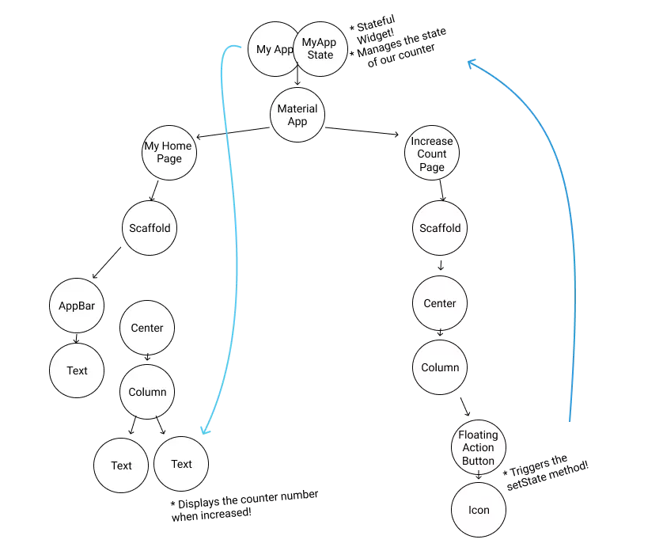
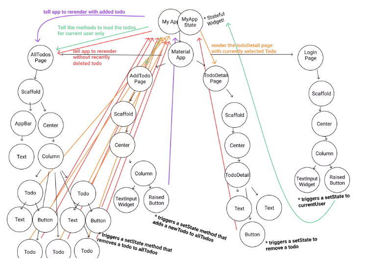
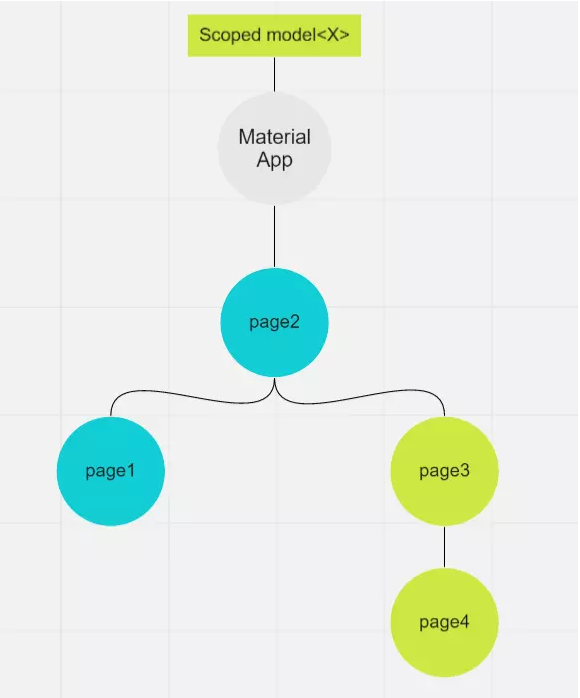
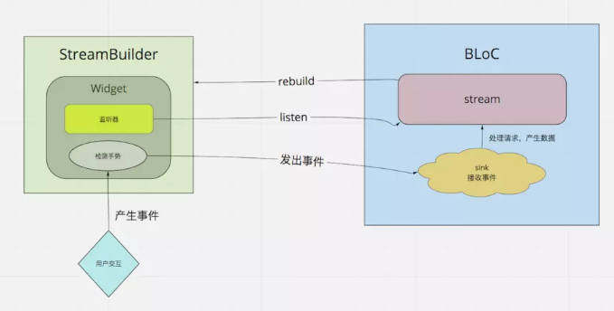
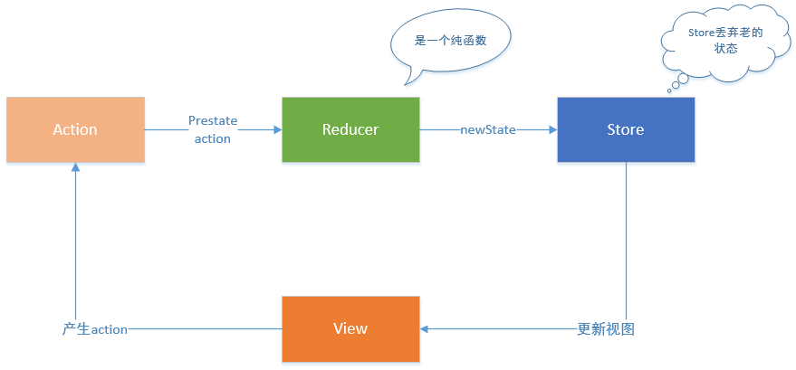

# 今日vip课题
```
今日课题：Flutter进阶必学--app状态管理
上课时间：2019/03/28 20:00
授课讲师：Zero老师[享学课堂]
课程链接：
课程内容：
1，为什么需要状态管理
2，状态管理框架概述
3，Redux原理深度剖析
4，Flutter-Redux大实战
5，互动答疑。
```

# 学习资料推荐
* dart: http://dart.goodev.org/guides/language
* Flutter: http://www.10tiao.com/html/169/201810/2650826370/1.html
# 前言
Flutter的很多灵感来自于React，它的设计思想是数据与视图分离，由数据映射渲染视图。所以在Flutter中，它的Widget是immutable的，
而它的动态部分全部放到了状态(State)中。于是状态管理自然便成了我们密切关注的对象
# 为什么需要状态管理
1. 在我们一开始构建应用的时候，也许很简单。我们有一些状态，直接把他们映射成视图就可以了。这种简单应用可能并不需要状态管理。

     

2. 但是随着功能的增加，你的应用程序将会有几十个甚至上百个状态。这个时候你的应用应该会是这样

     
    
    Wow，这是什么鬼。我们很难再清楚的测试维护我们的状态，因为它看上去实在是太复杂了！而且还会有多个页面共享同一个状态，
    例如当你进入一个文章点赞，退出到外部缩略展示的时候，外部也需要显示点赞数，这时候就需要同步这两个状态。
    这时候，我们便迫切的需要一个架构来帮助我们理清这些关系，状态管理框架应运而生。

# 状态管理框架概述
Flutter的状态管理框架目前知道的有以下
1. redux
2. Scoped Model
    * Scoped_model是一个dart第三方库，提供了让您能够轻松地将数据模型从父Widget传递到它的后代的功能。此外，它还会在模型更新时重新渲染使用该模型的所有子项。
    它直接来自于Google正在开发的新系统Fuchsia核心Widgets 中对Model类的简单提取，作为独立使用的独立Flutter插件发布。
    实现原理
    
         
    
    Scoped model使用了观察者模式，将数据模型放在父代，后代通过找到父代的model进行数据渲染，最后数据改变时将数据传回，父代再通知所有用到了该model的子代去更新状态。
    而我们则需要将它们放在顶层入口MaterialApp之上，这样就能进行全局的状态管理了。

3. BLoC (Business Logic Componet)
    * BLoC是一种利用reactive programming方式构建应用的方法，这是一个由流构成的完全异步的世界。
      
         
      
    *  用StreamBuilder包裹有状态的部件，streambuilder将会监听一个流
    *  这个流来自于BLoC
    *  有状态小部件中的数据来自于监听的流。
    *  用户交互手势被检测到，产生了事件。例如按了一下按钮。
    *  调用bloc的功能来处理这个事件
    *  在bloc中处理完毕后将会吧最新的数据add进流的sink中
    *  StreamBuilder监听到新的数据，产生一个新的snapshot，并重新调用build方法
    *  Widget被重新构建
      
    *  BLoC能够允许我们完美的分离业务逻辑！再也不用考虑什么时候需要刷新屏幕了,一切交给StreamBuilder和BLoC!和StatefulWidget说拜拜！！
    *  BLoC代表业务逻辑组件（Business Logic Component），由来自Google的两位工程师 Paolo Soares和Cong Hui设计，并在2018年DartConf期间（2018年1月23日至24日）首次展示。点击观看Youtube视频。。

4. Provide
    * 和Scoped_model一样，Provide也是借助了InheritWidget，将共享状态放到顶层MaterialApp之上。底层部件通过Provier获取该状态，并通过混合ChangeNotifier通知依赖于该状态的组件刷新。
    *  Provide还提供了Provide.stream，让我们能够以处理流的方式处理数据

## 1. redux
假如你曾进行过react开发，也许你一下会想到Redux,flutter有类似redux的状态管理的库吗？答案是肯定的。

### redux是什么
* Redux是一种单向数据流架构，可以轻松开发，维护和测试应用程序

     
    
1. Store: 就是保存数据的地方，你可以把它看成一个容器。整个应用只能有一个 Store。
2. State: Store对象包含所有数据。如果想得到某个时点的数据，就要对 Store 生成快照。这种时点的数据集合，就叫做 State
3. Action: 是一个对象。其中的type属性是必须的，表示 Action 的名称。其他属性可以自由设置
4. 纯函数是函数式编程的概念，必须遵守以下一些约束。 
   *  不得改写参数
   * 不能调用系统 I/O 的API
   * 不能调用Date.now()或者Math.random()等不纯的方法，因为每次会得到不一样的结果
5. Redux三大原则
    1. 单一的数据来源（App统一的Store）
    2. 状态State是只读的（数据不能直接修改，只能用过约定的Action触发，Reduce修改）
    3. 数据改动须是纯函数（这些纯函数叫Reducer，定义了如何修改Store，由Action触发）
6. Rexdux(3.0.0):    
    * Redux（3.0.0）是作者用Dart把JS 的redux库实现了，它定义了Store，Action，Reduce，Middleware以及它们之间的行为关系。
7. flutter_redux（0.5.2）:
    * flutter_redux（0.5.2）作为工具类桥接Redux和Flutter，它提供了StoreProvider，StoreBuilder，StoreConnector这些组件，使我们在flutter中使用redux变的很简便
    * StoreProvider - The base Widget. It will pass the given Redux Store to all descendants that request it.
    * StoreBuilder - A descendant Widget that gets the Store from a StoreProvider and passes it to a Widget builder function.
    * StoreConnector - A descendant Widget that gets the Store from the nearest StoreProvider ancestor, converts the Store into a ViewModel with the given converter function, and passes the ViewModel to a builder function. Any time the Store emits a change event, the Widget will automatically be rebuilt. No need to manage subscriptions!
### 使用redux
1. 添加支持库
```dart
dependencies:
    redux: ^3.0.0
    flutter_redux: ^0.5.2
```
2. 创建State
```dart
  import 'package:meta/meta.dart';
  /// 第二步创建State
  @immutable
  class CountState{
    int _count;
    get count => _count;
  
    CountState(this._count);
    CountState.initState():_count = 0;
  }
```

3. 创建action
```dart
  ///第三步 创建Action
  enum Actions{
    increment,
    decrement
  }
  
  // 定义所有action的基类
  class Action{
    final Actions  type;
  
    Action({this.type});
  }
  
  
  //加
  class IncreAction extends Action{
    int value;
    IncreAction(this.value):super(type:Actions.increment);
  }
  
  //减
  class DecreAction extends Action{
    int value;
    DecreAction(this.value):super(type:Actions.decrement);
  }
```

4. 创建reducer
```dart
  ///第四步 创建reducer
  CountState increReducer(CountState state,dynamic action){
    switch (action.type) {
      case Actions.increment:
        return  CountState(state.count + action.value);
      default:
        return state;
    }
  }
  
  CountState decreReducer(CountState state,dynamic action){
    switch (action.type) {
      case Actions.decrement:
       return CountState(state.count +action.value);
      default:
        return state;
    }
  }
  
  ///合并reducer
  final reducers = combineReducers<CountState>([
    increReducer,
    decreReducer,
  ]);
```
5. 创建store
```dart
  void main() {
    ///第五步 创建store
    final store = Store<CountState>(reducers,
        initialState: CountState.initState());
    runApp(MyApp(store));
  }
```
6. 将Store放入顶层
```dart
  class MyApp extends StatelessWidget {
  
    final Store<CountState> store;
  
    MyApp(this.store);
  
    @override
    Widget build(BuildContext context) {
      ///第六步 将Store放入顶层
      return StoreProvider<CountState>(
        store:store,
        child: MaterialApp(
          title: 'Flutter Demo',
          theme: ThemeData(
            primarySwatch: Colors.blue,
          ),
          home: FirstPage(title: "第一个页面"),
        ),
      );
    }
  }
```
7. 在子页面中获取Store中的state
```dart
   Padding(
              padding: const EdgeInsets.all(8.0),
              child: StoreConnector<CountState, int>(
                converter: (store) => store.state.count,
                builder: (context, count) {
                  return Text(
                    "现在的Count: $count",
                    style: Theme.of(context).textTheme.display1,
                  );
                },
              ),
            ),
```
8. 发出action
```dart
  Expanded(
                  child: Padding(
                    padding: const EdgeInsets.all(8.0),
                    ///第七步 发出action
                    child: StoreConnector<CountState, VoidCallback>(
                        builder: (BuildContext context, VoidCallback callback) {
                      return new RaisedButton(
                        onPressed: callback,
                        child: new Text("加一"),
                      );
                    }, converter: (Store<CountState> store) {
                      return () => store.dispatch(IncreAction(1));
                    }),
                  ),
                ),
```

9. 如何处理异步数据
添加redux_thunk

10. 状态持久化
添加redux_persist_flutter 


