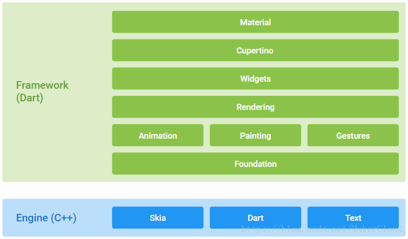
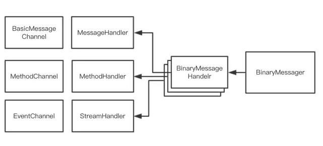
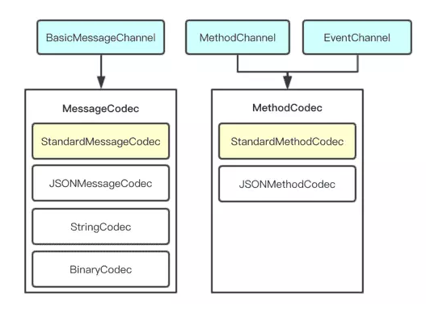
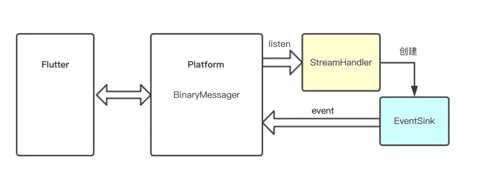
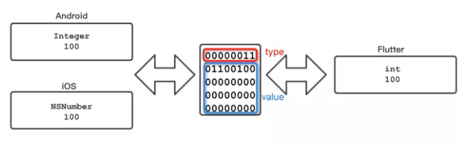
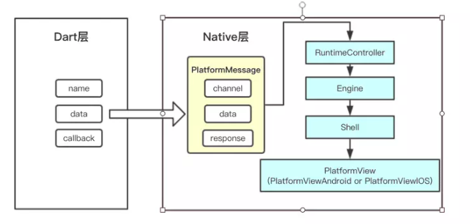
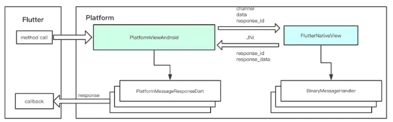

# Flutter Plugin  预习资料

[TOC]

## 前言
在Flutter中，如果我们需要打印日志，如果不进行自定义，我们只能使用自带的print()或者debugPrint()方法进行打印，
但是这两种打印，日志都是默认Info层级的日志，很不友好，所以如果需要日志打印层级分明，我们就需要自定义一个
日志打印组件，但是我希望这个打日志的组件也可以以后在其他项目里直接拿来使用.这就需要我们来开发一个日志的插件了，
再比如我们想在Flutter里面获取Android设备的信息，或者就是想用Native实现一个功能，然后能在Flutter里面使用. 等等...


## 什么是插件
在flutter中，一个插件叫做一个package，使用packages的目的就是为了达到模块化，可以创建出可被复用和共享的代码，
这和大多数编程语言中的模块、包的概念相同。创建出来的package可以在pubspec.yaml中直接依赖。

一个最小化的package包含了两部分： 
* 一个pubspec.yaml文件：一个元数据文件，声明了声明了package的名称、版本、作者等信息。

* 一个lib文件夹：包含里package的公开代码，文件夹至少需要存在<pakcage-name>.dart这个文件。
> 注意：<pakcage-name>.dart这个文件必须存在，因为这是方便使用的人快速import这个package来使用它，可以把它理解成一种必须要遵守的规则。

### package的种类
package可以分为两种：纯dart代码的package和带有特定平台代码的package。
    
* Dart packages：这是一个只有dart代码的package，里面包含了flutter的特定功能，所以它依赖于flutter的framework，也决定了它只能用在flutter上。
* plugin packages：这是一个既包含了dart代码编写的api，又包含了平台（Android/IOS）特定实现的package，可以被Android和ios调用。
> 上面应该很好理解，可以理解成java jar包和Android sdk的区别。而要开发的日志插件就是第二种。

## 开发步骤
### 开发 Dart packages
要创建Dart包，请使用--template=package 来执行 flutter create

```flutter create --template=package hello```

这将在hello/文件夹下创建一个具有以下专用内容的package工程：

* ```lib/hello.dart:```
    * Package的Dart代码
* ```test/hello_test.dart:```
    * Package的单元测试代码.
* 实现package
    * 对于纯Dart包，只需在主lib/<package name>.dart文件内或lib目录中的文件中添加功能 。
    * 要测试软件包，请在test目录中添加unit tests。
    
### 开发 plugin packages
#### Step 1: 创建 package
* 要创建插件包，请使用```--template=plugin```参数执行```flutter create```

* 使用--org选项指定您的组织，并使用反向域名表示法。该值用于生成的Android和iOS代码中的各种包和包标识符。

```flutter create --org com.example --template=plugin hello```
* 这将在hello/文件夹下创建一个具有以下专用内容的插件工程：

* lib/hello.dart:
    * 插件包的Dart API.
* android/src/main/java/com/yourcompany/​hello/HelloPlugin.java:
    * 插件包API的Android实现.
* ios/Classes/HelloPlugin.m:
    * 插件包API的ios实现.
* example/:
    * 一个依赖于该插件的Flutter应用程序，来说明如何使用它
默认情况下，插件项目针对iOS代码使用Objective-C，Android代码使用Java。如果您更喜欢Swift或Kotlin，则可以使用-i 或 -a 为iOS或Android指定语言。例如：

```flutter create --template=plugin -i swift -a kotlin hello```

#### Step 2: 实现包 package
* 由于插件包中包含用多种编程语言编写的多个平台的代码，因此需要一些特定的步骤来确保顺畅的体验。

* Step 2a: 定义包API（.dart）
插件包的API在Dart代码中定义。打开主文件夹hello/ 。找到lib/hello.dart

* Step 2b: 添加Android平台代码（.java / .kt）
我们建议您使用Android Studio编辑Android代码。

在Android Studio中编辑Android平台代码之前，首先确保代码至少已经构建过一次（例如，从IntelliJ运行示例应用程序或在终端执行cd hello/example; flutter build apk）


1. 启动Android Studio
2. 在’Welcome to Android Studio’对话框选择 ‘Import project’, 或者在菜单栏 ‘File > New > Import Project…‘,然后选择hello/example/android/build.gradle文件.
3. 在’Gradle Sync’ 对话框, 选择 ‘OK’.
4. 在’Android Gradle Plugin Update’ 对话框, 选择 ‘Don’t remind me again for this project’.
您插件的Android平台代码位于 hello/java/com.yourcompany.hello/​HelloPlugin.

您可以通过按下 ▶ 按钮从Android Studio运行示例应用程序.


* Step 2d: 连接API和平台代码
最后，您需要将用Dart代码编写的API与平台特定的实现连接起来。这是通过platform channels完成的。

#### 添加文档
建议将以下文档添加到所有软件包：

1. README.md:介绍包的文件
2. CHANGELOG.md 记录每个版本中的更改
3. LICENSE 包含软件包许可条款的文件

### 发布 packages
一旦你实现了一个包，你可以在Pub上发布它 ，这样其他开发人员就可以轻松使用它

在发布之前，检查```pubspec.yaml```、```README.md```以及```CHANGELOG.md```文件，以确保其内容的完整性和正确性。

然后, 运行 dry-run 命令以查看是否都准备OK了:

```flutter packages pub publish --dry-run```

最后, 运行发布命令:

```flutter packages pub publish```


## Plugin 通信原理
* 在介绍Plugin前，我们先简单了解一下Flutter：

 

* Flutter框架包括：Framework和Engine，他们运行在各自的Platform上。
* Framework是Dart语言开发的，包括Material Design风格的Widgets和Cupertino(iOS-style)风格的Widgets，以及文本、图片、按钮等基础Widgets；还包括渲染、动画、绘制、手势等基础能力。
* Engine是C++实现的，包括Skia（二维图形库）；Dart VM（Dart Runtime）；Text（文本渲染）等。
> 实际上，Flutter的上层能力都是Engine提供的。Flutter正是通过Engine将各个Platform的差异化抹平。而我们今天要讲的Plugin，正是通过Engine提供的Platform Channel实现的通信。


* Plugin其实就是一个特殊的Package。Flutter Plugin提供Android或者iOS的底层封装，在Flutter层提供组件功能，使Flutter可以较
方便的调取Native的模块。很多平台相关性或者对于Flutter实现起来比较复杂的部分，都可以封装成Plugin。其原理如下

 

通过上图，我们看到Flutter App是通过Plugin创建的Platform Channel调用的Native APIs。

### Platform Channel：

1. Flutter App (Client)，通过MethodChannel类向Platform发送调用消息；
2. Android Platform (Host)，通过MethodChannel类接收调用消息；
3. iOS Platform (Host)，通过FlutterMethodChannel类接收调用消息。

> PS：消息编解码器，是JSON格式的二进制序列化，所以调用方法的参数类型必须是可JSON序列化的。
> PS：方法调用，也可以反向发送调用消息。
* Android Platform
    > FlutterActivity，是Android的Plugin管理器，它记录了所有的Plugin，并将Plugin绑定到FlutterView。

### 理解Platform Channel工作原理
* Flutter定义了三种不同类型的Channel，它们分别是

* BasicMessageChannel：用于传递字符串和半结构化的信息。
* MethodChannel：用于传递方法调用（method invocation）。
* EventChannel: 用于数据流（event streams）的通信。

三种Channel之间互相独立，各有用途，但它们在设计上却非常相近。每种Channel均有三个重要成员变量：

* name:  String类型，代表Channel的名字，也是其唯一标识符。
* messager：BinaryMessenger类型，代表消息信使，是消息的发送与接收的工具。
* codec: MessageCodec类型或MethodCodec类型，代表消息的编解码器。

#### Channel name
​   一个Flutter应用中可能存在多个Channel，每个Channel在创建时必须指定一个独一无二的name，Channel之间使用name来区分彼此。当有消息从Flutter端发送到Platform端时，会根据其传递过来的channel name找到该Channel对应的Handler（消息处理器）。
#### 消息信使:BinaryMessenger



虽然三种Channel各有用途，但是他们与Flutter通信的工具却是相同的，均为BinaryMessager。
* BinaryMessenger是Platform端与Flutter端通信的工具，其通信使用的消息格式为二进制格式数据。当我们初始化一个Channel，并向该Channel注册处理消息的Handler时，实际上会生成一个与之对应的BinaryMessageHandler，并以channel name为key，注册到BinaryMessenger中。当Flutter端发送消息到BinaryMessenger时，BinaryMessenger会根据其入参channel找到对应的BinaryMessageHandler，并交由其处理。
* Binarymessenger在Android端是一个接口，其具体实现为FlutterNativeView。而其在iOS端是一个协议，名称为FlutterBinaryMessenger，FlutterViewController遵循了它。
* Binarymessenger并不知道Channel的存在，它只和BinaryMessageHandler打交道。而Channel和BinaryMessageHandler则是一一对应的。由于Channel从BinaryMessageHandler接收到的消息是二进制格式数据，无法直接使用，故Channel会将该二进制消息通过Codec（消息编解码器）解码为能识别的消息并传递给Handler进行处理。
* 当Handler处理完消息之后，会通过回调函数返回result，并将result通过编解码器编码为二进制格式数据，通过BinaryMessenger发送回Flutter端。


#### 消息编解码器:Codec



​   消息编解码器Codec主要用于将二进制格式的数据转化为Handler能够识别的数据，Flutter定义了两种Codec：MessageCodec和MethodCodec。
#####  MessageCodec
​   MessageCodec用于二进制格式数据与基础数据之间的编解码。BasicMessageChannel所使用的编解码器就是MessageCodec。
​   Android中，MessageCodec是一个接口，定义了两个方法:encodeMessage接收一个特定的数据类型T，并将其编码为二进制数据ByteBuffer，而decodeMessage则接收二进制数据ByteBuffer，将其解码为特定数据类型T。iOS中，其名称为FlutterMessageCodec，是一个协议，定义了两个方法：encode接收一个类型为id的消息，将其编码为NSData类型，而decode接收NSData类型消息，将其解码为id类型数据。
​   MessageCodec有多种不同的实现：


#####  BinaryCodec
BinaryCodec是最为简单的一种Codec，因为其返回值类型和入参的类型相同，均为二进制格式（Android中为ByteBuffer，iOS中为NSData）。实际上，BinaryCodec在编解码过程中什么都没做，只是原封不动将二进制数据消息返回而已。或许你会因此觉得BinaryCodec没有意义，但是在某些情况下它非常有用，比如使用BinaryCodec可以使传递内存数据块时在编解码阶段免于内存拷贝。


#####  StringCodec
StringCodec用于字符串与二进制数据之间的编解码，其编码格式为UTF-8。


* JSONMessageCodec
    * JSONMessageCodec用于基础数据与二进制数据之间的编解码，其支持基础数据类型以及列表、字典。其在iOS端使用了NSJSONSerialization作为序列化的工具，而在Android端则使用了其自定义的JSONUtil与StringCodec作为序列化工具。


* StandardMessageCodec
    * StandardMessageCodec是BasicMessageChannel的默认编解码器，其支持基础数据类型、二进制数据、列表、字典，其工作原理会在下文中详细介绍。


#####   MethodCodec
​   MethodCodec用于二进制数据与方法调用(MethodCall)和返回结果之间的编解码。MethodChannel和EventChannel所使用的编解码器均为MethodCodec。
​   与MessageCodec不同的是，MethodCodec用于MethodCall对象的编解码，一个MethodCall对象代表一次从Flutter端发起的方法调用。MethodCall有2个成员变量：String类型的method代表需要调用的方法名称，通用类型(Android中为Object，iOS中为id)的arguments代表需要调用的方法入参。
​   由于处理的是方法调用，故相比于MessageCodec，MethodCodec多了对调用结果的处理。当方法调用成功时，使用encodeSuccessEnvelope将result编码为二进制数据，而当方法调用失败时，则使用encodeErrorEnvelope将error的code、message、detail编码为二进制数据。
​   MethodCodec有两种实现：


* JSONMethodCodec
    * JSONMethodCodec的编解码依赖于JSONMessageCodec，当其在编码MethodCall时，会先将MethodCall转化为字典{"method":method,"args":args}。其在编码调用结果时，会将其转化为一个数组，调用成功为[result]，调用失败为[code,message,detail]。再使用JSONMessageCodec将字典或数组转化为二进制数据。


* StandardMethodCodec
    * MethodCodec的默认实现，StandardMethodCodec的编解码依赖于StandardMessageCodec，当其编码MethodCall时，会将method和args依次使用StandardMessageCodec编码，写入二进制数据容器。其在编码方法的调用结果时，若调用成功，会先向二进制数据容器写入数值0（代表调用成功），再写入StandardMessageCodec编码后的result。而调用失败，则先向容器写入数据1（代表调用失败），再依次写入StandardMessageCodec编码后的code，message和detail。


####   消息处理器：Handler
​   当我们接收二进制格式消息并使用Codec将其解码为Handler能处理的消息后，就该Handler上场了。Flutter定义了三种类型的Handler，与Channel类型一一对应。我们向Channel注册一个Handler时，实际上就是向BinaryMessager注册一个与之对应的BinaryMessageHandler。当消息派分到BinaryMessageHandler后，Channel会通过Codec将消息解码，并传递给Handler处理。
#####  . MessageHandler
​   MessageHandler用户处理字符串或者半结构化的消息，其onMessage方法接收一个T类型的消息，并异步返回一个相同类型result。MessageHandler的功能比较基础，使用场景较少，但是其配合BinaryCodec使用时，能够方便传递二进制数据消息。
#####   MethodHandler
​   MethodHandler用于处理方法的调用，其onMessage方法接收一个MethodCall类型消息，并根据MethodCall的成员变量method去调用对应的API，当处理完成后，根据方法调用成功或失败，返回对应的结果。

#####  StreamHandler

 


*   StreamHandler与前两者稍显不同，用于事件流的通信，最为常见的用途就是Platform端向Flutter端发送事件消息。当我们实现一个StreamHandler时，需要实现其onListen和onCancel方法。而在onListen方法的入参中，有一个EventSink（其在Android是一个对象，iOS端则是一个block）。我们持有EventSink后，即可通过EventSink向Flutter端发送事件消息。
 ​   实际上，StreamHandler工作原理并不复杂。当我们注册了一个StreamHandler后，实际上会注册一个对应的BinaryMessageHandler到BinaryMessager。而当Flutter端开始监听事件时，会发送一个二进制消息到Platform端。Platform端用MethodCodec将该消息解码为MethodCall，如果MethodCall的method的值为"listen"，则调用StreamHandler的onListen方法，传递给StreamHandler一个EventSink。而通过EventSink向Flutter端发送消息时，实际上就是通过BinaryMessager的send方法将消息传递过去。
####   理解消息编解码过程
 ​   在官方文档《Writing custom platform-specific code with platform channels》中的获取设备电量的例子中我们发现，Android端的返回值是java.lang.Integer类型的，而iOS端返回值则是一个NSNumber类型的（通过NSNumber numberWithInt:获取）。而到了Flutter端时，这个返回值自动"变成"了dart语言的int类型。那么这中间发生了什么呢？
 ​   Flutter官方文档表示，standard platform channels使用standard messsage codec对message和response进行序列化和反序列化，message与response可以是booleans, numbers, Strings, byte buffers,List, Maps等等，而序列化后得到的则是二进制格式的数据。
 ​   所以在上文提到的例子中，java.lang.Integer或NSNumber类型的返回值先是被序列化成了一段二进制格式的数据，然后该数据传递到传递到flutter侧后，被反序列化成了dart语言中的int类型的数据。
 ​   Flutter默认的消息编解码器是StandardMessageCodec,其支持的数据类型如下：
 

* 平台通道数据类型支持和解码器
* 标准平台通道使用标准消息编解码器，以支持简单的类似JSON值的高效二进制序列化，例如 booleans,numbers, Strings, byte buffers, List, Maps（请参阅StandardMessageCodec了解详细信息）。 当您发送和接收值时，这些值在消息中的序列化和反序列化会自动进行。

下表显示了如何在宿主上接收Dart值，反之亦然：

|Dart	|Android|	iOS|
|---|---|---|
|null	|null	|nil (NSNull when nested)|
|bool	|java.lang.Boolean	|NSNumber numberWithBool:|
|int	|java.lang.Integer	|NSNumber numberWithInt:|
|int, if 32 bits not enough	|java.lang.Long	|NSNumber numberWithLong:|
|int, if 64 bits not enough	|java.math.BigInteger	|FlutterStandardBigInteger|
|double	|java.lang.Double	|NSNumber numberWithDouble:|
|String	j|ava.lang.String	|NSString|
|Uint8List	|byte[]	|FlutterStandardTypedData typedDataWithBytes:|
|Int32List	|int[]	|FlutterStandardTypedData typedDataWithInt32:|
|Int64List	|long[]	|FlutterStandardTypedData typedDataWithInt64:|
|Float64List	|double[]	|FlutterStandardTypedData typedDataWithFloat64:|
|List	|java.util.ArrayList	|NSArray|
|Map	|java.util.HashMap	|NSDictionary|

* 当message或response需要被编码为二进制数据时，会调用StandardMessageCodec的writeValue方法，该方法接收一个名为value的参数，并根据其类型，向二进制数据容器(NSMutableData或ByteArrayOutputStream)写入该类型对应的type值，再将该数据转化为二进制表示，并写入二进制数据容器。
​   而message或者response需要被解码时，使用的是StandardMessageCodec的readValue方法，该方法接收到二进制格式数据后，会先读取一个byte表示其type，再根据其type将二进制数据转化为对应的数据类型。
​   在获取设备电量的例子中，假设设备的电量为100，当这个值被转化为二进制数据时，会先向二进制数据容器写入int类型对应的type值:3，再写入由电量值100转化而得的4个byte。而当Flutter端接收到该二进制数据时，先读取第一个byte值，并根据其值得出该数据为int类型，接着，读取紧跟其后的4个byte，并将其转化为dart类型的int。

     

* 对于字符串、列表、字典的编码会稍微复杂一些。字符串使用UTF-8编码得到的二进制数据是长度不定的，因此会在写入type后，先写入一个代表二进制数据长度的size，再写入数据。列表和字典则是写入type后，先写入一个代表列表或字典中元素个数的size，再递归调用writeValue方法将其元素依次写入。
###   理解消息传递过程
​   消息是如何从Flutter端传递到Platform端的呢？接下来我们以一次MethodChannel的调用为例，去理解消息的传递过程。
*  消息传递：从Flutter到Platform
#####  Dart层
​   当我们在Flutter端使用MethodChannel的invokeMethod方法发起一次方法调用时，就开始了我们的消息传递之旅。invokeMethod方法会将其入参message和arguments封装成一个MethodCall对象，并使用MethodCodec将其编码为二进制格式数据，再通过BinaryMessages将消息发出。（注意，此处提到的类名与方法名均为dart层的实现）
​   上述过程最终会调用到ui.Window的_sendPlatformMessage方法，该方法是一个native方法，其实现在native层，这与Java的JNI技术非常类似。我们向native层发送了三个参数：


* name，String类型，代表Channel名称
* data，ByteData类型，即之前封装的二进制数据
* callback，Function类型，用于结果回调

#####  Native层
​   到native层后，window.cc的SendPlatformMessage方法接受了来自dart层的三个参数，并对它们做了一定的处理：dart层的回调callback封装为native层的PlatformMessageResponseDart类型的response；dart层的二进制数据data转化为std::vector<uint8_t>类型数据data；根据response,data以及Channel名称name创建一个PlatformMessage对象，并通过dart_state->window()->client()->HandlePlatformMessage方法处理PlatformMessage对象。
​   dart_state->window()->client()是一个WindowClient，而其具体的实现为RuntimeController，RuntimeController会将消息交给其代理RuntimeDelegate处理。
​   RuntimeDelegate的实现为Engine，Engine在处理Message时，会判断该消息是否是为了获取资源（channel等于"flutter/assets"）,如果是，则走获取资源逻辑，否则调用Engine::Delegate的OnEngineHandlePlatformMessage方法。
​   Engine::Delegate的具体实现为Shell，其OnEngineHandlePlatformMessage接收到消息后，会向PlatformTaskRunner添加一个Task，该Task会调用PlatformView的HandlePlatformMessage方法。值得注意的是，Task中的代码执行在Platform Task Runner中，而之前的代码均执行在UI Task Runner中。

   

#####  消息处理
 ​   PlatformView的HandlePlatformMessage方法在不同平台有不同的实现，但是其基本原理是相同的。
#####  . PlatformViewAndroid
 ​   PlatformViewAndroid的是Platformview的子类，也是其在Android端的具体实现。当PlatformViewAndroid接收到PlatformMessage类型的消息时，如果消息中有response（类型为PlatformMessageResponseDart），则生成一个自增长的response_id,并以response_id为key，response为value存入字典pending_responses_中。接着，将channel和data均转化为Java可识别的数据，通过JNI向Java层发起调用，将response_id、channel和data传递过去。
 ​   Java层中，被调用的代码为FlutterNativeView (BinaryMessager的具体实现)的handlePlatformMessage，该方法会根据channel找到对应的BinaryMessageHandler并将消息传递给它处理。其具体处理过程我们已经在上文中详细分析过了，此处不再赘述。
 ​   BinaryMessageHandler处理完成后，FlutterNativeView会通过JNI调用native的方法，将response_data和response_id传递到native层。
 ​   native层，PlatformViewAndroid的InvokePlatformMessageResponseCallback接收到了respond_id和response_data。其先将response_data转化为二进制结果，并根据response_id，从panding_responses_中找到对应的PlatformMessageResponseDart对象，调用其Complete方法将二进制结果返回。
 
    

#####   PlatformViewIOS
​   PlatformViewIOS是PlatformView的子类，也是其在iOS端的具体实现，当PlatformViewIOS接收到message时会交给PlatformMessageRouter处理。
​   PlatformMessageRouter通过PlatformMessage中的channel找到对应的FlutterBinaryMessageHandler，并将二进制消息其处理，消息处理完成后，直接调用PlatformMessage对象中的PlatformMessageResponseDart对象的Complete方法将二进制结果返回。
#####   结果回传：从Platform到Flutter
​   PlatformMessageResponseDart的Complete方法向UI Task Runner添加了一个新的Task，这个Task的作用是将二进制结果从native的二进制数据类型转化为Dart的二进制数据类型response，并调用dart的callback将response传递到Dart层。
​   Dart层接收到二进制数据后，使用MethodCodec将数据解码，并返回给业务层。至此，一次从Flutter发起的方法调用就完整结束了。


