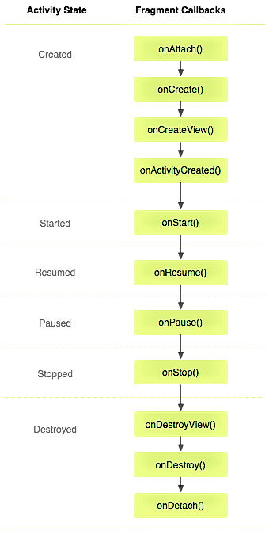
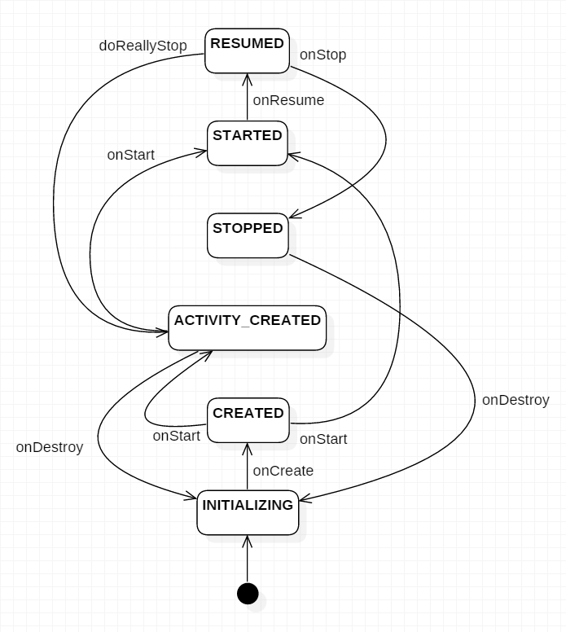

### Fragment你应该知道的一切

#### Fragment的产生与介绍
* Android运行在各种各样的设备中，有小屏幕的手机，超大屏的平板甚至电视。针对屏幕尺寸的差距，很多情况下，都是先针对手机开发一套App，然后拷贝一份，修改布局以适应平板神马超级大屏的。难道无法做到一个App可以同时适应手机和平板么，当然了，必须有啊。Fragment的出现就是为了解决这样的问题。你可以把Fragment当成Activity的一个界面的一个组成部分，甚至Activity的界面可以完全有不同的Fragment组成，更帅气的是Fragment拥有自己的生命周期和接收、处理用户的事件，这样就不必在Activity写一堆控件的事件处理的代码了。更为重要的是，你可以动态的添加、替换和移除某个Fragment。
##### 为什么要使用fragment
1. 单Activity＋多Fragment：
  * 一个app仅有一个Activity，界面皆是Frament，Activity作为app容器使用。
  * 优点：性能高，速度最快。参考：新版知乎 、google系app
2. 多模块Activity＋多Fragment
  * 优点：速度快，相比较单Activity+多Fragment，更易维护
3. 无视图的fragment 保存数据用
  * activity的onSaveInstanceState(Bundle outState)能保存的数据量有限，当有大量数据要保存的时候用无视图的fragment
  * Activity异常销毁时，onSaveInstanceState能保存的数据有限，数据过大容易oom。所以我们可以在onSaveInstanceState时attach一个Fragment，并将要存储的大数据保存到这个Fragment。当Activity重建时找到这个Fragment，再从中取出那些数据

#### FragmentPagerAdapter与FragmentStatePagerAdapter
```
    FragmentPagerAdapter：对于不再需要的fragment，选择调用detach方法，仅销毁视图，并不会销毁fragment实例。
    FragmentStatePagerAdapter：会销毁不再需要的fragment，当当前事务提交以后，会彻底的将fragmeng
        从当前Activity的FragmentManager中移除，state标明，销毁时，会将其onSaveInstanceState(Bundle outState)
        中的bundle信息保存下来，当用户切换回来，可以通过该bundle恢复生成新的fragment，也就是说，你可以在
        onSaveInstanceState(Bundle outState)方法中保存一些数据，在onCreate中进行恢复创建。
    FragmentStatePagerAdapter  FragmentPagerAdapter
             省内存                    不省
             创建需要时间              不要重新创建
             tab页面多                 tab  <= 4
             销毁                      detach
```
---
#### Fragment的生命周期

> onAttach(Activity)
  * 当Fragment与Activity发生关联时调用
> onCreateView(LayoutInflater, ViewGroup,Bundle)
  * 创建该Fragment的视图
> onActivityCreated(Bundle)
  * 当Activity的onCreate方法返回时调用
> onDestoryView()
  * 与onCreateView想对应，当该Fragment的视图被移除时调用
> onDetach()
  * 与onAttach相对应，当Fragment与Activity关联被取消时调用
  
   
--------------------------
##### 生命周期探究
* `onHiddenChanged`的回调时机
1. 当使用add()+show()，hide()跳转新的Fragment时，旧的Fragment回调onHiddenChanged()，不会回调onStop()等生命周期方法
2. 而新的Fragment在创建时是不会回调onHiddenChanged()

---
* Fragment 主要用于定义Fragment
* FragmentManager 主要用于在Activity中操作Fragment
* FragmentTransaction 保证一些列Fragment操作的原子性，熟悉事务这个词，一定能明白
##### 获取FragmentManage的方式
1. getFragmentManager()
2. v4中，getSupportFragmentManager
##### 主要的操作都是FragmentTransaction的方法
1. FragmentTransaction transaction = fm.benginTransatcion();//开启一个事务
2. transaction.add() 
往Activity中添加一个Fragment
3. transaction.remove()
从Activity中移除一个Fragment，如果被移除的Fragment没有添加到回退栈（回退栈后面会详细说），这个Fragment实例将会被销毁。
4. transaction.replace()
使用另一个Fragment替换当前的，实际上就是remove()然后add()的合体~
5. transaction.hide()
隐藏当前的Fragment，仅仅是设为不可见，并不会销毁
6. transaction.show()
显示之前隐藏的Fragment
7. detach()
会将view从UI中移除,和remove()不同,此时fragment的状态依然由FragmentManager维护。
8. attach()
重建view视图，附加到UI上并显示。
9. transatcion.commit()//提交一个事务

> 注意：常用Fragment的哥们，可能会经常遇到这样Activity状态不一致：State loss这样的错误。主要是因为：commit方法一定要在Activity.onSaveInstance()之前调用
* 比如：我在FragmentA中的EditText填了一些数据，当切换到FragmentB时，如果希望会到A还能看到数据，则适合你的就是hide和show；也就是说，希望保留用户操作的面板，你可以使用hide和show，当然了不要使劲在那new实例，进行下非null判断。
* 再比如：我不希望保留用户操作，你可以使用remove()，然后add()；或者使用replace()这个和remove,add是相同的效果。
* `remove`和`detach`有一点细微的区别，在不考虑回退栈的情况下，remove会销毁整个Fragment实例，而detach则只是销毁其视图结构，实例并不会被销毁。那么二者怎么取舍使用呢？如果你的当前Activity一直存在，那么在不希望保留用户操作的时候，你可以优先使用detach。
---
#### Fragment Arguments
> setArguments方法必须在fragment创建以后，添加给Activity前完成

#### Fragment与Activity通信
> fragment交互后数据应该通过接口返回给activity
1. 如果你Activity中包含自己管理的Fragment的引用，可以通过引用直接访问所有的Fragment的public方法
2. 如果Activity中未保存任何Fragment的引用，那么没关系，每个Fragment都有一个唯一的TAG或者ID,可以通过getFragmentManager.findFragmentByTag()或者findFragmentById()获得任何Fragment实例，然后进行操作。
3. 在Fragment中可以通过getActivity得到当前绑定的Activity的实例，然后进行操作。

---
#### Fragmeny与ActionBar和MenuItem集成
> Fragment可以添加自己的MenuItem到Activity的ActionBar或者可选菜单中。
1. 在Fragment的onCreate中调用 setHasOptionsMenu(true);
2. 然后在Fragment子类中实现onCreateOptionsMenu
3. 如果希望在Fragment中处理MenuItem的点击，也可以实现onOptionsItemSelected；当然了Activity也可以直接处理该MenuItem的点击事件。


