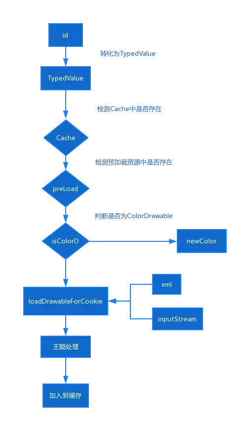

#### 换肤
---
#### Activity 与 AppCompatActivity的区别
当我们在老版本Android SDK开发的时候新建的Project的默认继承的是Activity，而在5.0之后默认继承的就是AppCompatActivity。二者的区别从AppCompatActivity的注释中可窥一斑。
* AppCompatActivity是所有使用了Support包中 ActionBar特性的Activity的父类
* 关系可以这么形容：AppCompatActivity————>FragmentActivity————>Activity
---
#### setContentView
* AppCompatActivity中的setContentView也非常简洁，可以看出来需要去代理类中继续查看代码。
```
    @Override
        public void setContentView(@LayoutRes int layoutResID) {
               final AppCompatDelegate delegate = getDelegate();
               delegate.installViewFactory();
               delegate.onCreate(savedInstanceState);
               ...
               super.onCreate(savedInstanceState);
        }
```

```
    ublic AppCompatDelegate getDelegate() {
            if (mDelegate == null) {
                mDelegate = AppCompatDelegate.create(this, this);
            }
            return mDelegate;
        }

        // 真正到了这里
        private static AppCompatDelegate create(Context context, Window window,
                AppCompatCallback callback) {
            if (Build.VERSION.SDK_INT >= 24) {
                return new AppCompatDelegateImplN(context, window, callback);
            } else if (Build.VERSION.SDK_INT >= 23) {
                return new AppCompatDelegateImplV23(context, window, callback);
            } else if (Build.VERSION.SDK_INT >= 14) {
                return new AppCompatDelegateImplV14(context, window, callback);
            } else if (Build.VERSION.SDK_INT >= 11) {
                return new AppCompatDelegateImplV11(context, window, callback);
            } else {
                return new AppCompatDelegateImplV9(context, window, callback);
            }
        }
```
* 而代理类实现的setContentView是在AppCompatDelegateImplV9中实现的：
* 此时我们可以看出setContentView中最复杂的代码就是ensureSubDecor，接下来的代码就只是使用SubDecor中的content，将我们传入的layout inflate出来然后加进去
```
    @Override
        public void setContentView(View v) {
            ensureSubDecor();
            ViewGroup contentParent = (ViewGroup) mSubDecor.findViewById(android.R.id.content);
            contentParent.removeAllViews();
            contentParent.addView(v);
            mOriginalWindowCallback.onContentChanged();
        }
```
##### createSubDecor
* setContentView的第一步就是确保SubDecor被install，下面源码中有注释
```
    // 此处可以看出SubDecor是一个ViewGroup
        private ViewGroup createSubDecor() {
            TypedArray a = mContext.obtainStyledAttributes(R.styleable.AppCompatTheme);

            if (!a.hasValue(R.styleable.AppCompatTheme_windowActionBar)) {
                a.recycle();
                // 这个错大家可能遇到过，当使用了AppCompatActivity但是没有设置一个Theme.AppCompat的主题，则会报这个Exception。
                throw new IllegalStateException(
                        "You need to use a Theme.AppCompat theme (or descendant) with this activity.");
            }

            // 接下来就到了设置一些Window属性的地方，下面会再说
            if (a.getBoolean(R.styleable.AppCompatTheme_windowNoTitle, false)) {
                requestWindowFeature(Window.FEATURE_NO_TITLE);// 设置无title
            } else if (a.getBoolean(R.styleable.AppCompatTheme_windowActionBar, false)) {
                // Don't allow an action bar if there is no title.
                requestWindowFeature(FEATURE_SUPPORT_ACTION_BAR);
            }
            if (a.getBoolean(R.styleable.AppCompatTheme_windowActionBarOverlay, false)) {
                requestWindowFeature(FEATURE_SUPPORT_ACTION_BAR_OVERLAY);
            }
            if (a.getBoolean(R.styleable.AppCompatTheme_windowActionModeOverlay, false)) {
                requestWindowFeature(FEATURE_ACTION_MODE_OVERLAY);
            }
            mIsFloating = a.getBoolean(R.styleable.AppCompatTheme_android_windowIsFloating, false);
            a.recycle();

            //TODO:  Now let's make sure that the Window has installed its decor by retrieving it
            mWindow.getDecorView();// 就是创建DecorView

            final LayoutInflater inflater = LayoutInflater.from(mContext);
            ViewGroup subDecor = null;

            // 根据标记来决定inflate哪个layout
            if (!mWindowNoTitle) {
                if (mIsFloating) {
                    // If we're floating, inflate the dialog title decor
                    subDecor = (ViewGroup) inflater.inflate(
                            R.layout.abc_dialog_title_material, null);

                    // Floating windows can never have an action bar, reset the flags
                    mHasActionBar = mOverlayActionBar = false;
                    ......
                } else if (mHasActionBar) {
                    ......
                }
            } else {
            }
            ...
            // Make the decor optionally fit system windows, like the window's decor
            ViewUtils.makeOptionalFitsSystemWindows(subDecor);
            //此时就开始创建真正的subDecor了，也有四个可选的layout，根据之前设置的属性来选择，然后去inflate出来。
            // SubDecor中也一定有这个id
            final ContentFrameLayout contentView = (ContentFrameLayout) subDecor.findViewById(
                    R.id.action_bar_activity_content);

            // 获取PhoneWindow中的content布局对象
            final ViewGroup windowContentView = (ViewGroup) mWindow.findViewById(android.R.id.content);
            if (windowContentView != null) {
               ...
                windowContentView.setId(View.NO_ID);
                // 将contentView的id设置为android.R.id.content
                contentView.setId(android.R.id.content);

                // The decorContent may have a foreground drawable set (windowContentOverlay).
                // Remove this as we handle it ourselves
                if (windowContentView instanceof FrameLayout) {
                    ((FrameLayout) windowContentView).setForeground(null);
                }
            }

            // Now set the Window's content view with the decor
            // 开始设置PhoneWindow的contentView，再把代码切到PhoneWindow中
            // mContentParent是不是看起来有点熟悉呢？generateLayout函数的返回值就是它
            mWindow.setContentView(subDecor);
            ...
            return subDecor;
        }
```
##### requestWindowFeature
```
    @Override
        public boolean requestWindowFeature(int featureId) {
            ......
            switch (featureId) {
                case FEATURE_SUPPORT_ACTION_BAR:
                    throwFeatureRequestIfSubDecorInstalled();
                    mHasActionBar = true;// 仅仅是对变量赋值
                    return true;
            ......
            }
            return mWindow.requestFeature(featureId);
        }
        // 这个又解释了一个原因，我们如果在setContentView之后再次去设置requestWindowFeature，会抛出Exception。
        private void throwFeatureRequestIfSubDecorInstalled() {
            if (mSubDecorInstalled) {
                throw new AndroidRuntimeException(
                        "Window feature must be requested before adding content");
            }
        }
```
##### mWindow.getDecorView()
* 各位小伙伴应该都知道Android里的Window这个类的实现子类其实是PhoneWindow，所以我们直接取PhoneWindow中去查getDecorView这个函数。最终会走到这里，注意下面两个标注了重点的地方
```
    private void installDecor() {
            mForceDecorInstall = false;
            if (mDecor == null) {
                mDecor = generateDecor(-1);// 重点
                mDecor.setDescendantFocusability(ViewGroup.FOCUS_AFTER_DESCENDANTS);
                mDecor.setIsRootNamespace(true);
                if (!mInvalidatePanelMenuPosted && mInvalidatePanelMenuFeatures != 0) {
                    mDecor.postOnAnimation(mInvalidatePanelMenuRunnable);
                }
            } else {
                mDecor.setWindow(this);
            }
            if (mContentParent == null) {
                mContentParent = generateLayout(mDecor);// 重点
                ......
            }
        }

        // generateDecor最后只是new了一个DecorView
        protected DecorView generateDecor(int featureId) {
            ......
            return new DecorView(context, featureId, this, getAttributes());
        }


        // 看一下DecorView的定义可以看出它是一个FrameLayout
        /** @hide */
        public class DecorView extends FrameLayout implements RootViewSurfaceTaker, WindowCallbacks {
        }
```
generateLayout函数过多，此处不贴出代码，值只分析下过程：

* 设置一些Window的属性；
* 根据Window属性选择一个layoutResource，这些layoutResource有一个共性是都有一个@android:id/content的布局，因为在AppCompatDelegateImplV9的createSubDecor函数里会用到这个content；
* 选出layoutResource之后会进入一句关键的代码：mDecor.onResourcesLoaded(mLayoutInflater, layoutResource)；layoutResource就被inflate出来并且添加到DecorView中了。备注，添加View的时候使用的LayoutParams是MATCH_PARENT；

##### 总结
* setContentView的过程就是通过PhoneWindow创建DecorView，然后创建SubDecor，最终将传递进来的布局add进来。
* 这样大家也更容易明白为什么通过一些性能分析工具查看布局层次及数量的时候总是比我们自己写的Layout多，也更容易明白对Activity设置View的函数被命名为setContentView。
---
#### LayoutInflater
* LayoutInflater 的作用就是将XML布局文件实例化为相应的 View 对象，需要通过Activity.getLayoutInflater() 或 Context.getSystemService(Class) 来获取与当前Context已经关联且正确配置的标准LayoutInflater。
##### 三种方法来获取 LayoutInflater
1. Activity.getLayoutInflater()；
2. LayoutInflater.from(context);
3. Context.getSystemService(Context.LAYOUT_INFLATER_SERVICE) ;
##### inflate 方法解析
* LayoutInflater 的 inflate 方法总共有四个，属于重载的关系，最终都会调用到 inflate(XmlPullParser parser, ViewGroup root, boolean attachToRoot) 方法
```
    public View inflate(XmlPullParser parser, @Nullable ViewGroup root, boolean attachToRoot) {
            synchronized (mConstructorArgs) {
                Trace.traceBegin(Trace.TRACE_TAG_VIEW, "inflate");

                final Context inflaterContext = mContext;
                final AttributeSet attrs = Xml.asAttributeSet(parser);
                Context lastContext = (Context) mConstructorArgs[0];
                mConstructorArgs[0] = inflaterContext;
                View result = root;

                try {
                    // Look for the root node.
                    int type;
                    // ① 寻找布局的根节点，判断布局的合理性
                    while ((type = parser.next()) != XmlPullParser.START_TAG &&
                            type != XmlPullParser.END_DOCUMENT) {
                        // Empty
                    }
                    if (type != XmlPullParser.START_TAG) {
                        throw new InflateException(parser.getPositionDescription()
                                + ": No start tag found!");
                    }
                    final String name = parser.getName();
                    if (TAG_MERGE.equals(name)) {
                    // ② 如果是Merge标签，则必须依附于一个RootView，否则抛出异常
                        if (root == null || !attachToRoot) {
                            throw new InflateException("<merge /> can be used only with a valid "
                                    + "ViewGroup root and attachToRoot=true");
                        }
                        rInflate(parser, root, inflaterContext, attrs, false);
                    } else {
                        // Temp is the root view that was found in the xml
                        // ③ 根据节点名来创建View对象
                        final View temp = createViewFromTag(root, name, inflaterContext, attrs);
                        ViewGroup.LayoutParams params = null;
                        if (root != null) {
                            if (DEBUG) {
                                System.out.println("Creating params from root: " +
                                        root);
                            }
                            // Create layout params that match root, if supplied
                            // ④ 如果设置的Root不为null，则根据当前标签的参数生成LayoutParams
                            params = root.generateLayoutParams(attrs);
                            if (!attachToRoot) {
                                // Set the layout params for temp if we are not
                                // attaching. (If we are, we use addView, below)
                                // ⑤ 如果不是attachToRoot ，则对这个Tag和创建出来的View设置LayoutParams；注意：此处的params只有当被添加到一个Viewz中的时候才会生效；
                                temp.setLayoutParams(params);
                            }
                        }
                        if (DEBUG) {
                            System.out.println("-----> start inflating children");
                        }
                        // Inflate all children under temp against its context.
                        // ⑥ inflate children tag
                        rInflateChildren(parser, temp, attrs, true);
                        // We are supposed to attach all the views we found (int temp)
                        // to root. Do that now.
                        if (root != null && attachToRoot) {
                            // ⑦ 如果Root不为null且是attachToRoot，则添加创建出来的View到Root 中
                            root.addView(temp, params);
                        }
                        // Decide whether to return the root that was passed in or the
                        // top view found in xml.
                        if (root == null || !attachToRoot) {
                            result = temp;
                        }
                    }
                } catch (XmlPullParserException e) {
                    ......
                }
                return result;
            }
        }
```
1. 如果root为null，attachToRoot将失去作用，设置任何值都没有意义；
2. 如果root不为null，attachToRoot设为true，则会给加载的布局文件的指定一个父布局，即root；
3. 如果root不为null，attachToRoot设为false，则会将布局文件最外层的所有layout属性进行设置，当该view被添加到父view当中时，这些layout属性会自动生效；
4. 在不设置attachToRoot参数的情况下，如果root不为null，attachToRoot参数默认为true；
##### rInflate 方法解析
```
    void rInflate(XmlPullParser parser, View parent, Context context,
                AttributeSet attrs, boolean finishInflate) throws XmlPullParserException, IOException {
            final int depth = parser.getDepth();
            int type;
            boolean pendingRequestFocus = false;
            while (((type = parser.next()) != XmlPullParser.END_TAG ||
                    parser.getDepth() > depth) && type != XmlPullParser.END_DOCUMENT) {
                if (type != XmlPullParser.START_TAG) {
                    continue;
                }
                final String name = parser.getName();
                if (TAG_REQUEST_FOCUS.equals(name)) {
                    pendingRequestFocus = true;
                    consumeChildElements(parser);
                } else if (TAG_TAG.equals(name)) {
                    parseViewTag(parser, parent, attrs);
                } else if (TAG_INCLUDE.equals(name)) {
                    if (parser.getDepth() == 0) {
                    // ① 如果这里出现了include标签，就会抛出异常
                        throw new InflateException("<include /> cannot be the root element");
                    }
                    parseInclude(parser, context, parent, attrs);
                } else if (TAG_MERGE.equals(name)) {
                    // ② 同理如果这里出现了merge标签，也会抛出异常
                    throw new InflateException("<merge /> must be the root element");
                } else {
                    // ③ 最重要的方法在这里，createViewFromTag
                    final View view = createViewFromTag(parent, name, context, attrs);
                    final ViewGroup viewGroup = (ViewGroup) parent;
                    final ViewGroup.LayoutParams params = viewGroup.generateLayoutParams(attrs);
                    // ④如果当前View是ViewGroup（包裹了别的View）则在此处inflate其所有的子View
                    rInflateChildren(parser, view, attrs, true);
                    // ⑤添加inflate出来的view到parent中
                    viewGroup.addView(view, params);
                }
            }
            if (pendingRequestFocus) {
                parent.restoreDefaultFocus();
            }
            if (finishInflate) {
                // ⑥如果inflate结束，则回调parent的onFinishInflate方法
                parent.onFinishInflate();
            }
        }
```
* 首先进行View的合理性校验，include、merge等标签；
* 通过 createViewFromTag 创建出 View 对象；
* 如果是 ViewGroup，则重复以上步骤；
* add View 到相应的 parent 中；
##### createViewFromTag 方法解析
```
    View createViewFromTag(View parent, String name, Context context, AttributeSet attrs,
                boolean ignoreThemeAttr) {
            ......
            try {
                View view;
                if (mFactory2 != null) {
                    // ① 有mFactory2，则调用mFactory2的onCreateView方法
                    view = mFactory2.onCreateView(parent, name, context, attrs);
                } else if (mFactory != null) {
                    // ② 有mFactory，则调用mFactory的onCreateView方法
                    view = mFactory.onCreateView(name, context, attrs);
                } else {
                    view = null;
                }
                if (view == null && mPrivateFactory != null) {
                    // ③ 有mPrivateFactory，则调用mPrivateFactory的onCreateView方法
                    view = mPrivateFactory.onCreateView(parent, name, context, attrs);
                }
                if (view == null) {
                    // ④ 走到这步说明三个Factory都没有，则开始自己创建View
                    final Object lastContext = mConstructorArgs[0];
                    mConstructorArgs[0] = context;
                    try {
                        if (-1 == name.indexOf('.')) {
                            // ⑤ 如果View的name中不包含 '.' 则说明是系统控件，会在接下来的调用链在name前面加上 'android.view.'
                            view = onCreateView(parent, name, attrs);
                        } else {
                            // ⑥ 如果name中包含 '.' 则直接调用createView方法，onCreateView 后续也是调用了createView
                            view = createView(name, null, attrs);
                        }
                    } finally {
                        mConstructorArgs[0] = lastContext;
                    }
                }
                return view;
            } catch (InflateException e) {
                throw e;
            }
        }
```
* createViewFromTag 方法比较简单，首先尝试通过 Factory 来创建View；
* 如果没有 Factory 的话则通过 createView 来创建View；
##### createView 方法解析
```
    public final View createView(String name, String prefix, AttributeSet attrs)
                throws ClassNotFoundException, InflateException {
           ...
            Class<? extends View> clazz = null;
            try {
                Trace.traceBegin(Trace.TRACE_TAG_VIEW, name);
                if (constructor == null) {
                    ...
                    // ① 反射获取这个View的构造器
                    constructor = clazz.getConstructor(mConstructorSignature);
                    constructor.setAccessible(true);
                    // ② 缓存构造器
                    sConstructorMap.put(name, constructor);
                } else {
                    ...
                }
                ...
                Object[] args = mConstructorArgs;
                args[1] = attrs;
                // ③ 使用反射创建 View 对象，这样一个 View 就被创建出来了
                final View view = constructor.newInstance(args);
                ...
                mConstructorArgs[0] = lastContext;
                return view;
            } catch (ClassCastException e) {
            }
        }
```
* createView 方法也比较简单，通过反射来创建的 View 对象；
##### 总结
* 通过本文我们学习到 LayoutInflater 创建 View的过程，也知道了 inflate 方法不同参数的意义，以及开发中遇到的一些异常在源码中的根源。可以看到从布局中 inflate 一个个具体的 View 的过程其实也很简单：
1. 通过 XML 的 Pull 解析方式获取 View 的标签；
2. 通过标签以反射的方式来创建 View 对象；
3. 如果是 ViewGroup 的话则会对子 View 遍历并重复以上步骤，然后 add 到父 View 中；
4. 与之相关的几个方法：inflate ——》 rInflate ——》 createViewFromTag ——》 createView ；
---
#### LayoutInflater Factory
* View 的 inflate 中有一个方法 createViewFromTag，会首先尝试通过 Factory 来 CreateView
```
    View view;
        if (mFactory2 != null) {
            // ① 有mFactory2，则调用mFactory2的onCreateView方法
            view = mFactory2.onCreateView(parent, name, context, attrs);
        } else if (mFactory != null) {
            // ② 有mFactory，则调用mFactory的onCreateView方法
            view = mFactory.onCreateView(name, context, attrs);
        } else {
            view = null;
        }
```
* 正常情况下这个Factory是空的，那什么时候不为空，以及 LayoutInflater Factory 的具体用法，我们今天就带着这两个问题来详细学习下
##### LayoutInflater.Factory 简介
* 通过 LayoutInflater 创建View时候的一个回调，可以通过LayoutInflater.Factory来改造 XML 中存在的 tag
* 那么我们就明白了，如果我们设置了LayoutInflater Factory ，在LayoutInflater 的 createViewFromTag 方法中就会通过这个 Factory 的 onCreateView 方法来创建 View。
```
    LayoutInflater.from(this).setFactory2(new LayoutInflater.Factory2() {
                @Override
                public View onCreateView(View parent, String name, Context context, AttributeSet attrs) {
                    if(TextUtils.equals(name,"TextView")){
                        Button button = new Button(MainActivity.this);
                        button.setText("我替换了TextView");
                        button.setAllCaps(false);
                        return button;
                    }
                    return getDelegate().createView(parent, name, context, attrs);
                }

                @Override
                public View onCreateView(String name, Context context, AttributeSet attrs) {
                    return null;
                }
            });
```
* 备注：其实还有一个关系密切的类 LayoutInflater.Factory2 ，与 LayoutInflater.Factory 的区别是：
* LayoutInflater.Factory2 是API 11 被加进来的；
* LayoutInflater.Factory2 继承自 LayoutInflater.Factory；
* 可以对创建 View 的 Parent 进行控制；
##### LayoutInflaterCompat
* LayoutInflaterCompat 就是拿来做兼容的类
##### LayoutInflater.setFactory 使用注意
* 如果我们将LayoutInflater.setFactory 挪到 super.onCreate 的后面可以吗？ 程序竟然报错了，我们看下Log
* 如果 layoutInflater.getFactory() 为空，则 AppCompatActivity 会自动设置一个 Factory2，难怪我们在 super.onCreate 之后调用会报错；
* 细心的小伙伴肯定也明白了，为什么我们在 super.onCreate 之前设置 Factory之后，系统再次设置 Factory 的时候不会抛出异常；
##### AppCompatActivity 为什么 setFactory
那么为什么 AppCompatActivity 会自动设置一个 Factory呢？顺着 AppCompatDelegateImplV9 的 installViewFactory方法继续跟踪，走到了 onCreateView 方法，它最终会调用到 AppCompatViewInflater 的 createView 方法
```
    public final View createView(View parent, final String name, @NonNull Context context,
                @NonNull AttributeSet attrs, boolean inheritContext,
                boolean readAndroidTheme, boolean readAppTheme, boolean wrapContext) {
            View view = null;
            // We need to 'inject' our tint aware Views in place of the standard framework versions
            switch (name) {
                case "TextView":
                    view = new AppCompatTextView(context, attrs);
                    break;
                case "ImageView":
                    view = new AppCompatImageView(context, attrs);
                    break;
                case "Button":
                    view = new AppCompatButton(context, attrs);
                    break;
                ......
            }
            return view;
        }
```
* 原来 AppCompatActivity 设置 Factory 是为了将一些 widget 自动变成 兼容widget （例如将 TextView 变成 AppCompatTextView）以便于向下兼容新版本中的效果，在高版本中的一些 widget 新特性就是这样在老版本中也能展示的。
* 那如果我们设置了自己的 Factory 岂不是就避开了系统的兼容？其实系统的兼容我们仍然可以保存下来，因为系统是通过 AppCompatDelegate.onCreateView 方法来实现 widget 兼容的，那我们就可以在设置 Factory 的时候先调用 AppCompatDelegate.onCreateView 方法，再来做我们的处理。
##### 总结
1. LayoutInflater.Factory的意义：通过 LayoutInflater 创建 View 时候的一个回调，可以通过 LayoutInflater.Factory 来改造或定制创建 View 的过程。
2. LayoutInflater.setFactory 使用注意：不能在 super.onCreate 之后设置。
3. AppCompatActivity 为什么 setFactory ？向下兼容新版本中的效果
---
---
* 在编译的时候，AAPT会扫描你所定义的所有资源（在不同文件中定义的以及单独的资源文件），然后给它们指定不同的资源ID。
资源ID 是一个32bit的数字，格式是PPTTNNNN ， PP代表资源所属的包(package) ,TT代表资源的类型(type)，NNNN代表这个类型下面的资源的名称。 对于应用程序的资源来说，PP的取值是0×77。
TT 和NNNN 的取值是由AAPT工具随意指定的–基本上每一种新的资源类型的数字都是从上一个数字累加的（从1开始）；而每一个新的资源条目也是从数字1开始向上累加的。
---
#### Resource
* 对于资源的装载机制，这里核心的几个类是Resources，ResourcesImpl，AssetManager。Resources算是对于ResourcesImpl的一个代理，Resources的所有调用都是会调用到ResourcesImpl上，在ResourcesImpl的内部，具备对于资源的Cache和AssetManager，对于资源的装载会首先从其Cache中进行查找，当查找不到的时候，会调用AssetManager进行相应资源的装载，装载之后会在ResourcesImpl中将资源缓存下来

* 对于资源的加载，大概可以通过上图进行概括，根据ID获取TypedValue，TypedValue的获取是在AssetManager添加资源路径的时候，通过对资源表的解析来构建的一个ResTable，通过该数据结构根据ID作为索引查找并构建TypedValue，然后再根据资源文件的类型，借助TypedValue内存储的关于资源的详细信息来获取资源，同时将加载的资源进行缓存。因此在插件化的方案中，通过创建新的Resource对象，为其添加新的Asset路径，从而构建出一个新的ResTable，实现通过ID进行非宿主App资源的装载。


