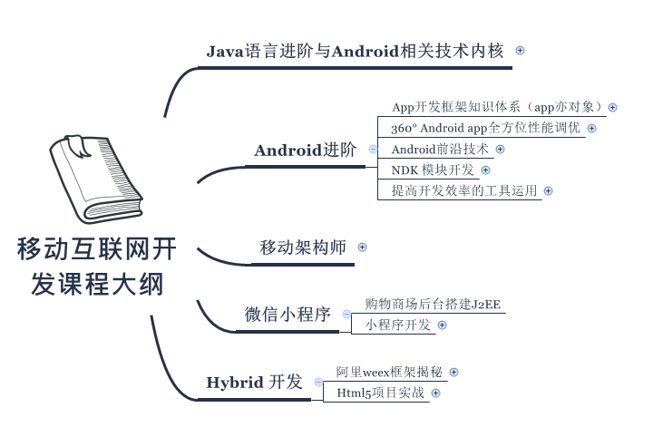

### 1. 引起学生的共鸣
* 这步操作需要根据具体的课程来
* 比如讲Navigation的课程，
     1. 同学们有没有觉得现在Android开发越来越简单了 -> 互动
        > 分析：现在的Android提供给我们的API功能越来越丰富啦，事情越来越简单了
     2. 这对我们Android开发者来说是好事 也是坏事
        > 1. 加快我们构建App的速度
        > 2. 只会使用API的开发者必将要淘汰
     3. 互动  强调只有不断学习才不会被淘汰
---
### 过渡
* 同学们，今天这节课 大家收获的干货很多，你想要去互联网大公司拿高薪 确实要掌握这点，但是仅凭这点就能拿50K以上的薪资了吗？
   显然不是的
* 那么如果你想成为一个知识体系完整，没有短板的的工程师，想快速提升的话，应该怎么做，接下来 zero老师给同学们分享下从事移动互联网
开发，你的知识体系应该是什么样子的，应该达到什么样的广度和深度？
---
### 2.如何学习？
* 跟着我们享学一起学习
* 分析知识树

 
1. 首先，从知识的广度上看，我们这有五大专题，Java语言进价，需要理解jvm的运行原理，
2. 然后是Android进价，这里我们又分了五个小专题
   * App开发框架知识体系
   * 360度 Android App全方位的性能优化
   * Android前沿技术
   * NDK模块开发技术
   * 工具的使用
3. 然后就是移动架构师 应该掌握的知识，我们不仅仅是代码的搬运工，而是代码的架构师
4. 然后就是当下很火的 微信小程序开发
5. 最后是Hybrid混合开发

* 深度上
1. 先介绍Java相关的
 面试题  泛型有什么好处与坏处？ 注解有什么好处与坏处？

 注解：从编写框架的角度来看 编译期注解的坏处是处理起来麻烦，运行期的注解的坏处就是使用反射比较耗性能，从使用的角度来看 坏处就是可能造成业务逻辑的碎片化
2. Android 核心进阶
* 价值：花时间带大家深入研究源码 原理，我们不是教大家怎么用，不是告诉同学们如何使用轮子，而是带大家造轮子
* 面试题：handler原理机制，gradlew编译过程，View事件分发机制
* 优化： 360全方位的优化：
* 代码结构的优化 ：设计模式 23种常见的设计模式 数据结构 排序算法 查找算法
  学习了app的创建，然后学习了然后提高性能，也懂前沿技术，我们应用前沿技术，穿插ndk模块，实现了一个高性能的app,这是一个工程师的技能
  作为一个架构师是要高于代码的，那么我们就要重构我们的app,我们需要运行MVC，MVP，MVVM的思维来重构
  我们还会带着大家学习混合开发

* 代码框架结构优化：
* 价值： 带大家从设计模式，代码结构上去优化，
* 面试题：如何优化网络流量？

* 代码质量调优： 如何自定义Lint检查规则

* 前沿技术 不断更新，不仅限现有的
* 面试题：如何优化Volley的缓存框架？

* NDK：我们会讲解Ndk开发的基础 ，还会讲解图片处理，音视频开发应用，还会有各种人工智能的讲解

### 3.1.支付保障
前面是我们的课程大纲，在这再来讲下大家的疑虑，为什么这么讲呢？你可能有这样的疑虑，我现在报名，你会不会卷款逃了，那我怎么办?

* 我这里强调一下，你们的学费是交给腾讯课堂，并不是交给享学课堂的，你们是在腾讯课堂上报的名，腾讯课堂上报名就会有支付保障，你的学费是交给腾讯课堂，腾讯课堂会监督我们的教学质量和售后服务，如果我们做得不到位，你们得学费是不会到达我们这的。
这个有点像大家在支付宝上买东西，在淘宝上买东风，支付宝就是你保障。

### 3.2.师资保障
* 第二个就是师资保障，我们这谁给你上课啊，这里有5位老师，5位全职的老师在给你讲课，这些老师都是在一线互联网公司工作了10年以上工作经验的，像华为，像阿里，像这样经验的一些老师给你讲课，讲完课，这样的一些课件。
（打开网盘）
有人在说，我前面的课没听，现在能跟得上吗？一定能跟的上，像我们讲注解，讲代理模式的时候，听完了，你没跟上，那我retrofit的源码分析我就听不懂了吗？一定听得懂，zero老师会快点给大家过下之前学过的知识点，你也可以去看录播，所以当然也能听，
反倒你现在学，我感觉有优势，因为现在学，这些视频我们已经讲完了，你现在要赶进度直接去学，在家里反复去听，周末，放假去赶上进度就完了。后面得课程只要你不拉下，我相信你现在得学习进度一定能超过这几百为已经报名得学员（打开报名页），他们都是一堂课一堂课来学得，而你现在报名来学，你就是弯道超车，什么叫弯道超车，就是我前面没学，我现在来学可以赶进度，一节课一节课得赶上去，这进度赶成和这几百位同学一样的，这个能不能做到，当然是可以的。
做到的基础就是这些视频，笔记，源码，都是你的。
（打开一个视频）

### 3.3.怎么教？教学方式
* 3.3.1.资深讲师服务：
前面以及讲过，我们有10余年互联网项目开发经验的老师来给同学们讲课，提供22*7小时答疑服务
* 3.3.2.学习方式
课前发放复习资料，课中直播教学，课后提供视频、源码以及课件反复提升

* 3.3.5.VIP班主任督学
班主任就是售后服务，希望大家重视的就是售后服务，并不是我们一讲课就一拍屁股走人，不理你了，不是这样的，我们会为每个学员配备班主任，讲得好，讲的不好，有意见和班主任提，班主任会反馈到老师这里，老师会改进，同时呢，班主任还是简单你们的考勤，学习进度，作业完成情况，如果旷课，班主任小姐姐是在后面拿鞭子抽你的，监督你学习，你进步。

* 3.3.6.课程升级
我们的技术是不断的进步的，所以我们的课程也会与时俱进，不断的进行升级

* 3.3.7.学习氛围
（开QQVIP群）
学习氛围我希望大家自己去感受一下，好不好，像这样的聊天记录是没办法造假的吧，他们在聊什么，绝大多数在聊技术，在问问题，你有问题，问大家，大家会解答你，别人有问题，你也会解答，大家都解决不了的问题问谁？找老师，这就是学习的氛围。

有些同学说，我在上大学的时候，下面乱哄哄的，该吃瓜子的时候吃瓜子，吃西瓜的吃西瓜，学习的结果就是我去了南翔技术学校。这种结果当然是不好的，让人沮丧的。

在我们这里的学习情况有是怎么样的呢，给大家看一下。

* 3.3.10.有人说我有空了再来学习
千万不要给我说，我有空了再来学习，我送大家一句话，不要用战术上的勤奋掩盖你战略上的懒惰，我每天加班很忙，每天再写公司的业务代码，同学们，你们确实很勤奋，但这是战术上的勤奋，但实际上，你要学习，学习才是你的方向，但是你在逃避这个事情。
看这里截取的这些图啊，同学们这些图在讲什么？果断上课，拒绝加班（1），我是加班来着，怕后面跟不上（2），加班的时候来听课（3），同学这了没闲人，每个人都很忙，但他们都意思到自己要学习，为什么？因为他们知道学习的重要性。
送你一句话：“比你优秀的对手在学习，你的仇人在磨刀，你的闺蜜在减肥，隔壁老王在练腰，我们必须不断的学习，否则我们将被学习者超越”，就是这样子，就这样个残酷的现实，我只能告诉你这是个机会，你们来，deer老师欢迎，你们犹豫，deer老师也没法劝你，为什么？因为在这里已经很多同学在学习了，这些人就是你的竞争对手，在这里deer老师只能让你的竞争对手更优秀，你却还在那纠结，还在那犹豫。
学习的速度就是成功的速度，你纠结犹豫一天，一个月，一年，那你离成功就慢了一天，一个月，一年， -。

* 3.3.11.BATJ内推
* 3.3.12.推活动

