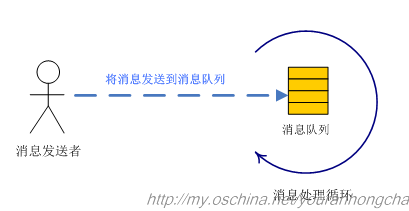
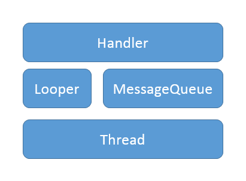
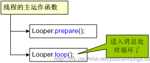
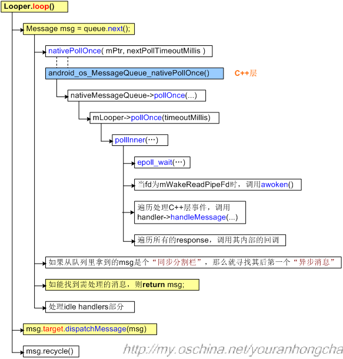
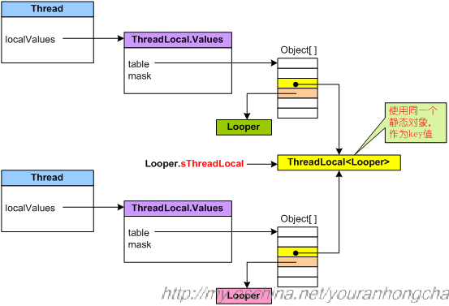
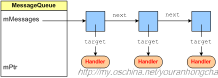
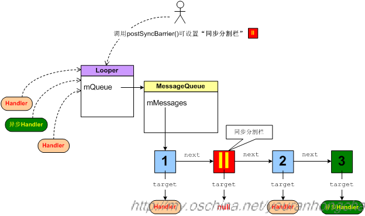

# 深入理解Handler消息机制
### 概述
在Android平台上，主要用到两种通信机制，即Binder机制和消息机制，前者用于跨进程通信，后者用于进程内部通信。
从技术实现上来说，消息机制还是比较简单的。从大的方面讲，不光是Android平台，各种平台的消息机制的原理基本上都是相近的，其中用到的主要概念大概有：
>androidsdk：
>一个Handler允许你发送和处理消息（Message）以及与一个线程的消息队列相关的Runnable对象。每个Handler实例都和单个线程以及该线程的消息队列有关。当你创建了一个新Handler，它就会和创建它的线程/消息队列绑定，在那以后，它就会传递消息以及runnable对象给消息队列，然后执行它们。
>需要使用Handler有两大主要的原因：
> 1. 在将来的某个时间点调度处理消息和runnable对象；
> 2. 将需要执行的操作放到其他线程之中，而不是自己的；

1. 消息发送者；
2. 消息队列；
3. 消息处理循环



图中表达的基本意思是，消息发送者通过某种方式，将消息发送到某个消息队列里，同时还有一个消息处理循环，不断从消息队列里摘取消息，并进一步解析处理

android中的消息驱动机制
* 接收消息的“消息队列” ——【MessageQueue】
* 阻塞式地从消息队列中接收消息并进行处理的“线程” ——【Thread+Looper】
* 可发送的“消息的格式” ——【Message】
* “消息发送函数”——【Handler的post和sendMessage】
> 一个Looper类似一个消息泵。它本身是一个死循环，不断地从MessageQueue中提取Message或者Runnable。而Handler可以看做是一个Looper的暴露接口，向外部暴露一些事件，并暴露sendMessage()和post()函数。




### 为什么要使用Handler
* 子线程不允许访问 UI
1. 假若子线程允许访问 UI，则在多线程并发访问情况下，会使得 UI 控件处于不可预期的状态。 传统解决办法：加锁，但会使得UI访问逻辑变的复杂，其次降低 UI 访问的效率。
2. ViewRootImpl的checkThread方法验证

* 引入 Handler
1. 采用单线程模型处理 UI 操作，通过 Handler 切换到 UI 线程，解决子线程中无法访问 UI 的问题。


### Handler的使用方法介绍
* 跳到代码解说
1. 能讲讲Android的Handler机制吗？
2. Handler可以new 多个吗?
3. Looper可以有多个吗?
4. MessageQueue可以有多个吗?
5. 只能在UI线程里面更新界面吗？
6. Android子线程更新UI的方式有几种？
7. 使用Handler的时候一般会遇到什么问题？8. 在线程中可以new Handler?
9. 问在一个工作线程中创建自己的消息队例应该怎么做？
10. 你知道HandlerThread是什么吗？
11. 怎么在主线程中通知子线程？这样做有什么好处？

12. 在子线程使用Handler前一定要先为子线程创建Looper，创建的方式是直接调用Looper.prepare()方法。前面我们说过创建Handler对象时如果没有给它指定Looper，那么它默认会使用当前线程的Looper，而线程默认是没有Looper的，所以使用前一定要先创建Looper。
13. 在同一个线程里，Looper.prepare()方法不能被调用两次。因为同一个线程里，最多只能有一个Looper对象。
14. 只有调用了Looper.loop()方法，Handler机制才能正常工作。 Looper负责管理MessageQueue，它的loop()方法负责从MessageQueue里取出消息并交给Handler处理，所以如果没有调用Looper.loop()方法，消息就不会被取出和处理。
15. Looper.loop()方法一定要在调用了Looper.prepare()方法之后调用。那是因为如果当前线程还没有Looper，是不能调用Looper.loop()方法开启消息轮询的，否则会报错。
16. 不要在主线程调用Looper.prepare()方法。这是因为在Android系统创建主线程的时候就已经调用了Looper.prepare()方法和Looper.loop()方法，这也是为什么我们在主线程使用Handler时不需要调用这两个方法的原因。
17. 当我们在子线程使用Handler时，如果Handler不再需要发送和处理消息，那么一定要退出子线程的消息轮询。因为Looper.loop()方法里是一个死循环，如果我们不主动结束它，那么它就会一直运行，子线程也会一直运行而不会结束。退出消息轮询的方法是
```
    Looper.myLooper().quit();
    Looper.myLooper().quitSafely();
```

###### Handler发送消息方法总结
```
//延时发送消息
    public final boolean sendMessageDelayed(Message msg, long delayMillis)
    public final boolean postDelayed(Runnable r, long delayMillis);

    //定时发送消息
    public boolean sendMessageAtTime(Message msg, long uptimeMillis) {
    public final boolean postAtTime(Runnable r, long uptimeMillis);
    public final boolean postAtTime(Runnable r, Object token, long uptimeMillis);
    post(Runnable),
    postAtTime(Runnable, long)
    postDelayed(Runnable, long),
    sendEmptyMessage(int),
    sendMessage(Message),
    sendMessageAtTime(Message,long)
    sendMessageDelayed(Message,long)
    在kotlin中定义静态常量是通过 companion object 关键字来定义的。
    Handler中存在多种类型的消息时，在Java中使用 switch 语句来判断，而kotlin中使用 when 语句替代了，用法如上面案例中的用法，when 语句中的 else 作用和Java中 switch 的 default 作用是一样的。
    在kotlin中定义Handler时必须要写 object : Handler 否则无法重写 handleMessage(Message msg) 方法
```

1. 使用Message.obtain()来获取一个消息。前面我们的例子中获取一个消息都是用new的方式直接创建，我这样做只是为了方便大家的理解而已。在使用中不推荐用这种方式来获取一个消息，而是使用Message.obtain()方法。
Message msg = Message.obtain();复制代码Android会为Message提供一个缓存池，把使用过的消息缓存起来，方便下次使用。我们用Message.obtain()方法获取一个消息时，会先从缓存池获取，如果缓存池没有消息，才会去创建消息。这样做可以优化内存。
2. 同一个Message不要发送两次。如下面的代码是有问题的：
    //同一个Message发送了两次
```
    Message msg = Message.obtain();
    handler.sendMessage(msg);
    handler.sendMessage(msg);
 ```
 3. Android已经提供了很多实现了Handler的类和方法，方便我们使用。如Activity类的runOnUiThread()方法，View的post()方法，HandlerThread
 4.
 ```
    Message的回调方法优先级最高，即message.callback.run()；
    Handler的回调方法优先级次之，即Handler.mCallback.handleMessage(msg)；
    Handler的默认方法优先级最低，即Handler.handleMessage(msg)。
 ```

### 深入Handler源码


```
framework/base/core/java/andorid/os/
  - Handler.java
  - Looper.java
  - Message.java
  - MessageQueue.java
framework/base/core/jni/android_os_MessageQueue.cpp
system/core/libutils/Looper.cpp （Native层）
system/core/include/utils/Looper.h
system/core/libutils/RefBase.cpp

framework/base/native/android/looper.cpp （ALoop对象）
framework/native/include/android/looper.h
```

###、Looper

 

 

* prepare()
* 对于无参的情况，默认调用prepare(true)，表示的是这个Looper运行退出，而对于false的情况则表示当前Looper不运行退出。
```
private static void prepare(boolean quitAllowed) {
    //每个线程只允许执行一次该方法，第二次执行时线程的TLS已有数据，则会抛出异常。
    if (sThreadLocal.get() != null) {
        throw new RuntimeException("Only one Looper may be created per thread");
    }
    //创建Looper对象，并保存到当前线程的TLS区域
    sThreadLocal.set(new Looper(quitAllowed));
}
```
* 这里的sThreadLocal是ThreadLocal类型，下面，先说说ThreadLocal。

* ThreadLocal： 线程本地存储区（Thread Local Storage，简称为TLS），每个线程都有自己的私有的本地存储区域，不同线程之间彼此不能访问对方的TLS区域。TLS常用的操作方法：

* ThreadLocal.set(T value)：将value存储到当前线程的TLS区域，源码如下：
```
  public void set(T value) {
      Thread currentThread = Thread.currentThread(); //获取当前线程
      Values values = values(currentThread); //查找当前线程的本地储存区
      if (values == null) {
          //当线程本地存储区，尚未存储该线程相关信息时，则创建Values对象
          values = initializeValues(currentThread);
      }
      //保存数据value到当前线程this
      values.put(this, value);
  }
```
* ThreadLocal.get()：获取当前线程TLS区域的数据，源码如下：
```
  public T get() {
      Thread currentThread = Thread.currentThread(); //获取当前线程
      Values values = values(currentThread); //查找当前线程的本地储存区
      if (values != null) {
          Object[] table = values.table;
          int index = hash & values.mask;
          if (this.reference == table[index]) {
              return (T) table[index + 1]; //返回当前线程储存区中的数据
          }
      } else {
          //创建Values对象
          values = initializeValues(currentThread);
      }
      return (T) values.getAfterMiss(this); //从目标线程存储区没有查询是则返回null
  }
```
* ThreadLocal的get()和set()方法操作的类型都是泛型，接着回到前面提到的sThreadLocal变量，其定义如下：

```static final ThreadLocal<Looper> sThreadLocal = new ThreadLocal<Looper>()```
* 可见sThreadLocal的get()和set()操作的类型都是Looper类型。

 

```Looper.prepare()```

* Looper.prepare()在每个线程只允许执行一次，该方法会创建Looper对象，Looper的构造方法中会创建一个MessageQueue对象，再将Looper对象保存到当前线程TLS。

* 对于Looper类型的构造方法如下：
```
private Looper(boolean quitAllowed) {
    mQueue = new MessageQueue(quitAllowed);  //创建MessageQueue对象. 【见4.1】
    mThread = Thread.currentThread();  //记录当前线程.
}
```
* 另外，与prepare()相近功能的，还有一个prepareMainLooper()方法，该方法主要在ActivityThread类中使用。
```
public static void prepareMainLooper() {
    prepare(false); //设置不允许退出的Looper
    synchronized (Looper.class) {
        //将当前的Looper保存为主Looper，每个线程只允许执行一次。
        if (sMainLooper != null) {
            throw new IllegalStateException("The main Looper has already been prepared.");
        }
        sMainLooper = myLooper();
    }
}
```
*  loop()
```
public static void loop() {
    final Looper me = myLooper();  //获取TLS存储的Looper对象 【见2.4】
    if (me == null) {
        throw new RuntimeException("No Looper; Looper.prepare() wasn't called on this thread.");
    }
    final MessageQueue queue = me.mQueue;  //获取Looper对象中的消息队列

    Binder.clearCallingIdentity();
    //确保在权限检查时基于本地进程，而不是基于最初调用进程。
    final long ident = Binder.clearCallingIdentity();

    for (;;) { //进入loop的主循环方法
        Message msg = queue.next(); //可能会阻塞 【见4.2】
        if (msg == null) { //没有消息，则退出循环
            return;
        }

        Printer logging = me.mLogging;  //默认为null，可通过setMessageLogging()方法来指定输出，用于debug功能
        if (logging != null) {
            logging.println(">>>>> Dispatching to " + msg.target + " " +
                    msg.callback + ": " + msg.what);
        }
        msg.target.dispatchMessage(msg); //用于分发Message 【见3.2】
        if (logging != null) {
            logging.println("<<<<< Finished to " + msg.target + " " + msg.callback);
        }

        final long newIdent = Binder.clearCallingIdentity(); //确保分发过程中identity不会损坏
        if (ident != newIdent) {
             //打印identity改变的log，在分发消息过程中是不希望身份被改变的。
        }
        msg.recycleUnchecked();  //将Message放入消息池 【见5.2】
    }
}
```
* loop()进入循环模式，不断重复下面的操作，直到没有消息时退出循环

* 读取MessageQueue的下一条Message；
* 把Message分发给相应的target；
* 再把分发后的Message回收到消息池，以便重复利用。
* 这是这个消息处理的核心部分。另外，上面代码中可以看到有logging方法，这是用于debug的，默认情况下logging == null，通过设置setMessageLogging()用来开启debug工作。

*  quit()
```
public void quit() {
    mQueue.quit(false); //消息移除
}

public void quitSafely() {
    mQueue.quit(true); //安全地消息移除
}
```
* Looper.quit()方法的实现最终调用的是MessageQueue.quit()方法
```
MessageQueue.quit()

void quit(boolean safe) {
        // 当mQuitAllowed为false，表示不运行退出，强行调用quit()会抛出异常
        if (!mQuitAllowed) {
            throw new IllegalStateException("Main thread not allowed to quit.");
        }
        synchronized (this) {
            if (mQuitting) { //防止多次执行退出操作
                return;
            }
            mQuitting = true;
            if (safe) {
                removeAllFutureMessagesLocked(); //移除尚未触发的所有消息
            } else {
                removeAllMessagesLocked(); //移除所有的消息
            }
            //mQuitting=false，那么认定为 mPtr != 0
            nativeWake(mPtr);
        }
    }
```
* 消息退出的方式：

* 当safe =true时，只移除尚未触发的所有消息，对于正在触发的消息并不移除；
* 当safe =flase时，移除所有的消息
###  常用方法
* myLooper
* 用于获取TLS存储的Looper对象
```
public static @Nullable Looper myLooper() {
        return sThreadLocal.get();
    }
```
* post
* 发送消息，并设置消息的callback，用于处理消息。

```
public final boolean post(Runnable r) {
   return  sendMessageDelayed(getPostMessage(r), 0);
}

private static Message getPostMessage(Runnable r) {
    Message m = Message.obtain();
    m.callback = r;
    return m;
}
```
### Handler
* 创建Handler
*  无参构造
```
public Handler() {
    this(null, false);
}

public Handler(Callback callback, boolean async) {
    //匿名类、内部类或本地类都必须申明为static，否则会警告可能出现内存泄露
    if (FIND_POTENTIAL_LEAKS) {
        final Class<? extends Handler> klass = getClass();
        if ((klass.isAnonymousClass() || klass.isMemberClass() || klass.isLocalClass()) &&
                (klass.getModifiers() & Modifier.STATIC) == 0) {
            Log.w(TAG, "The following Handler class should be static or leaks might occur: " +
                klass.getCanonicalName());
        }
    }
    //必须先执行Looper.prepare()，才能获取Looper对象，否则为null.
    mLooper = Looper.myLooper();  //从当前线程的TLS中获取Looper对象【见2.1】
    if (mLooper == null) {
        throw new RuntimeException("");
    }
    mQueue = mLooper.mQueue; //消息队列，来自Looper对象
    mCallback = callback;  //回调方法
    mAsynchronous = async; //设置消息是否为异步处理方式
}
```
* 对于Handler的无参构造方法，默认采用当前线程TLS中的Looper对象，并且callback回调方法为null，且消息为同步处理方式。只要执行的Looper.prepare()方法，那么便可以获取有效的Looper对象。

* 3.1.2 有参构造
```
public Handler(Looper looper) {
    this(looper, null, false);
}

public Handler(Looper looper, Callback callback, boolean async) {
    mLooper = looper;
    mQueue = looper.mQueue;
    mCallback = callback;
    mAsynchronous = async;
}
```
* Handler类在构造方法中，可指定Looper，Callback回调方法以及消息的处理方式(同步或异步)，对于无参的handler，默认是当前线程的Looper。

* 消息分发机制
* 在Looper.loop()中，当发现有消息时，调用消息的目标handler，执行dispatchMessage()方法来分发消息。
```
public void dispatchMessage(Message msg) {
    if (msg.callback != null) {
        //当Message存在回调方法，回调msg.callback.run()方法；
        handleCallback(msg);
    } else {
        if (mCallback != null) {
            //当Handler存在Callback成员变量时，回调方法handleMessage()；
            if (mCallback.handleMessage(msg)) {
                return;
            }
        }
        //Handler自身的回调方法handleMessage()
        handleMessage(msg);
    }
}
```
###### 分发消息流程：

1. 当Message的回调方法不为空时，则回调方法msg.callback.run()，其中callBack数据类型为Runnable,否则进入步骤2；
2. 当Handler的mCallback成员变量不为空时，则回调方法mCallback.handleMessage(msg),否则进入步骤3；
3. 调用Handler自身的回调方法handleMessage()，该方法默认为空，Handler子类通过覆写该方法来完成具体的逻辑。
4. 对于很多情况下，消息分发后的处理方法是第3种情况，即Handler.handleMessage()，一般地往往通过覆写该方法从而实现自己的业务逻辑。

### 消息发送
发送消息调用链：


* 从上图，可以发现所有的发消息方式，最终都是调用MessageQueue.enqueueMessage();

#### sendEmptyMessage
```
public final boolean sendEmptyMessage(int what) {
    return sendEmptyMessageDelayed(what, 0);
}
```
#### sendEmptyMessageDelayed
```
public final boolean sendEmptyMessageDelayed(int what, long delayMillis) {
    Message msg = Message.obtain();
    msg.what = what;
    return sendMessageDelayed(msg, delayMillis);
}
```
#### sendMessageDelayed
```
public final boolean sendMessageDelayed(Message msg, long delayMillis) {
    if (delayMillis < 0) {
        delayMillis = 0;
    }
    return sendMessageAtTime(msg, SystemClock.uptimeMillis() + delayMillis);
}
```
#### sendMessageAtTime
```
public boolean sendMessageAtTime(Message msg, long uptimeMillis) {
    MessageQueue queue = mQueue;
    if (queue == null) {
        return false;
    }
    return enqueueMessage(queue, msg, uptimeMillis);
}
```
#### sendMessageAtFrontOfQueue
```
public final boolean sendMessageAtFrontOfQueue(Message msg) {
    MessageQueue queue = mQueue;
    if (queue == null) {
        return false;
    }
    return enqueueMessage(queue, msg, 0);
}
```
* 该方法通过设置消息的触发时间为0，从而使Message加入到消息队列的队头。

#### post
```
public final boolean post(Runnable r) {
   return  sendMessageDelayed(getPostMessage(r), 0);
}
```
```
private static Message getPostMessage(Runnable r) {
    Message m = Message.obtain();
    m.callback = r;
    return m;
}
```
#### postAtFrontOfQueue
```
public final boolean postAtFrontOfQueue(Runnable r) {
    return sendMessageAtFrontOfQueue(getPostMessage(r));
}
```
#### enqueueMessage
```
private boolean enqueueMessage(MessageQueue queue, Message msg, long uptimeMillis) {
    msg.target = this;
    if (mAsynchronous) {
        msg.setAsynchronous(true);
    }
    return queue.enqueueMessage(msg, uptimeMillis); 【见4.3】
}
```
####  小节
* Handler.sendEmptyMessage()等系列方法最终调用MessageQueue.enqueueMessage(msg, uptimeMillis)，将消息添加到消息队列中，其中uptimeMillis为系统当前的运行时间，不包括休眠时间。

#### 其他方法
* obtainMessage
* 获取消息
```
public final Message obtainMessage() {
    return Message.obtain(this); 【见5.2】
}
```
* Handler.obtainMessage()方法，最终调用Message.obtainMessage(this)，其中this为当前的Handler对象。

#### removeMessages
```
public final void removeMessages(int what) {
    mQueue.removeMessages(this, what, null); 【见 4.5】
}
```
* Handler是消息机制中非常重要的辅助类，更多的实现都是MessageQueue, Message中的方法，Handler的目的是为了更加方便的使用消息机制。

### MessageQueue

 

* MessageQueue是消息机制的Java层和C++层的连接纽带，大部分核心方法都交给native层来处理，其中MessageQueue类中涉及的native方法如下：
```
private native static long nativeInit();
private native static void nativeDestroy(long ptr);
private native void nativePollOnce(long ptr, int timeoutMillis);
private native static void nativeWake(long ptr);
private native static boolean nativeIsPolling(long ptr);
private native static void nativeSetFileDescriptorEvents(long ptr, int fd, int events);
```
* 关于这些native方法的介绍，见Android消息机制2-Handler(native篇)。

#### 创建MessageQueue
```
MessageQueue(boolean quitAllowed) {
    mQuitAllowed = quitAllowed;
    //通过native方法初始化消息队列，其中mPtr是供native代码使用
    mPtr = nativeInit();
}
```
#### next()
* 提取下一条message
```
Message next() {
    final long ptr = mPtr;
    if (ptr == 0) { //当消息循环已经退出，则直接返回
        return null;
    }
    int pendingIdleHandlerCount = -1; // 循环迭代的首次为-1
    int nextPollTimeoutMillis = 0;
    for (;;) {
        if (nextPollTimeoutMillis != 0) {
            Binder.flushPendingCommands();
        }
        //阻塞操作，当等待nextPollTimeoutMillis时长，或者消息队列被唤醒，都会返回
        nativePollOnce(ptr, nextPollTimeoutMillis);
        synchronized (this) {
            final long now = SystemClock.uptimeMillis();
            Message prevMsg = null;
            Message msg = mMessages;
            if (msg != null && msg.target == null) {
                //当消息Handler为空时，查询MessageQueue中的下一条异步消息msg，则退出循环。
                do {
                    prevMsg = msg;
                    msg = msg.next;
                } while (msg != null && !msg.isAsynchronous());
            }
            if (msg != null) {
                if (now < msg.when) {
                    //当异步消息触发时间大于当前时间，则设置下一次轮询的超时时长
                    nextPollTimeoutMillis = (int) Math.min(msg.when - now, Integer.MAX_VALUE);
                } else {
                    // 获取一条消息，并返回
                    mBlocked = false;
                    if (prevMsg != null) {
                        prevMsg.next = msg.next;
                    } else {
                        mMessages = msg.next;
                    }
                    msg.next = null;
                    //设置消息的使用状态，即flags |= FLAG_IN_USE
                    msg.markInUse();
                    return msg;   //成功地获取MessageQueue中的下一条即将要执行的消息
                }
            } else {
                //没有消息
                nextPollTimeoutMillis = -1;
            }
            //消息正在退出，返回null
            if (mQuitting) {
                dispose();
                return null;
            }
            //当消息队列为空，或者是消息队列的第一个消息时
            if (pendingIdleHandlerCount < 0 && (mMessages == null || now < mMessages.when)) {
                pendingIdleHandlerCount = mIdleHandlers.size();
            }
            if (pendingIdleHandlerCount <= 0) {
                //没有idle handlers 需要运行，则循环并等待。
                mBlocked = true;
                continue;
            }
            if (mPendingIdleHandlers == null) {
                mPendingIdleHandlers = new IdleHandler[Math.max(pendingIdleHandlerCount, 4)];
            }
            mPendingIdleHandlers = mIdleHandlers.toArray(mPendingIdleHandlers);
        }
        //只有第一次循环时，会运行idle handlers，执行完成后，重置pendingIdleHandlerCount为0.
        for (int i = 0; i < pendingIdleHandlerCount; i++) {
            final IdleHandler idler = mPendingIdleHandlers[i];
            mPendingIdleHandlers[i] = null; //去掉handler的引用
            boolean keep = false;
            try {
                keep = idler.queueIdle();  //idle时执行的方法
            } catch (Throwable t) {
                Log.wtf(TAG, "IdleHandler threw exception", t);
            }
            if (!keep) {
                synchronized (this) {
                    mIdleHandlers.remove(idler);
                }
            }
        }
        //重置idle handler个数为0，以保证不会再次重复运行
        pendingIdleHandlerCount = 0;
        //当调用一个空闲handler时，一个新message能够被分发，因此无需等待可以直接查询pending message.
        nextPollTimeoutMillis = 0;
    }
}
```
* nativePollOnce是阻塞操作，其中nextPollTimeoutMillis代表下一个消息到来前，还需要等待的时长；当nextPollTimeoutMillis = -1时，表示消息队列中无消息，会一直等待下去。

* 当处于空闲时，往往会执行IdleHandler中的方法。当nativePollOnce()返回后，next()从mMessages中提取一个消息。

* nativePollOnce()在native做了大量的工作，想进一步了解可查看 Android消息机制2-Handler(native篇)。

#### enqueueMessage
* 添加一条消息到消息队列
```
boolean enqueueMessage(Message msg, long when) {
    // 每一个普通Message必须有一个target
    if (msg.target == null) {
        throw new IllegalArgumentException("Message must have a target.");
    }
    if (msg.isInUse()) {
        throw new IllegalStateException(msg + " This message is already in use.");
    }
    synchronized (this) {
        if (mQuitting) {  //正在退出时，回收msg，加入到消息池
            msg.recycle();
            return false;
        }
        msg.markInUse();
        msg.when = when;
        Message p = mMessages;
        boolean needWake;
        if (p == null || when == 0 || when < p.when) {
            //p为null(代表MessageQueue没有消息） 或者msg的触发时间是队列中最早的， 则进入该该分支
            msg.next = p;
            mMessages = msg;
            needWake = mBlocked; //当阻塞时需要唤醒
        } else {
            //将消息按时间顺序插入到MessageQueue。一般地，不需要唤醒事件队列，除非
            //消息队头存在barrier，并且同时Message是队列中最早的异步消息。
            needWake = mBlocked && p.target == null && msg.isAsynchronous();
            Message prev;
            for (;;) {
                prev = p;
                p = p.next;
                if (p == null || when < p.when) {
                    break;
                }
                if (needWake && p.isAsynchronous()) {
                    needWake = false;
                }
            }
            msg.next = p;
            prev.next = msg;
        }
        //消息没有退出，我们认为此时mPtr != 0
        if (needWake) {
            nativeWake(mPtr);
        }
    }
    return true;
}
```
* MessageQueue是按照Message触发时间的先后顺序排列的，队头的消息是将要最早触发的消息。当有消息需要加入消息队列时，会从队列头开始遍历，直到找到消息应该插入的合适位置，以保证所有消息的时间顺序。

####  removeMessages
```
void removeMessages(Handler h, int what, Object object) {
    if (h == null) {
        return;
    }
    synchronized (this) {
        Message p = mMessages;
        //从消息队列的头部开始，移除所有符合条件的消息
        while (p != null && p.target == h && p.what == what
               && (object == null || p.obj == object)) {
            Message n = p.next;
            mMessages = n;
            p.recycleUnchecked();
            p = n;
        }
        //移除剩余的符合要求的消息
        while (p != null) {
            Message n = p.next;
            if (n != null) {
                if (n.target == h && n.what == what
                    && (object == null || n.obj == object)) {
                    Message nn = n.next;
                    n.recycleUnchecked();
                    p.next = nn;
                    continue;
                }
            }
            p = n;
        }
    }
}
```
* 这个移除消息的方法，采用了两个while循环，第一个循环是从队头开始，移除符合条件的消息，第二个循环是从头部移除完连续的满足条件的消息之后，再从队列后面继续查询是否有满足条件的消息需要被移除。

 

#### postSyncBarrier
```public int postSyncBarrier() { return postSyncBarrier(SystemClock.uptimeMillis()); }```
```
private int postSyncBarrier(long when) { synchronized (this) { final int token = mNextBarrierToken++; final Message msg = Message.obtain(); msg.markInUse(); msg.when = when; msg.arg1 = token;

      Message prev = null;
      Message p = mMessages;
      if (when != 0) {
          while (p != null && p.when <= when) {
              prev = p;
              p = p.next;
          }
      }
      if (prev != null) { // invariant: p == prev.next
          msg.next = p;
          prev.next = msg;
      } else {
          msg.next = p;
          mMessages = msg;
      }
      return token;
  }   }
  ```
* 前面小节[4.3]已说明每一个普通Message必须有一个target，对于特殊的message是没有target，即同步barrier token。 这个消息的价值就是用于拦截同步消息，所以并不会唤醒Looper.
```
public void removeSyncBarrier(int token) {
     synchronized (this) {
         Message prev = null;
         Message p = mMessages;
         //从消息队列找到 target为空,并且token相等的Message
         while (p != null && (p.target != null || p.arg1 != token)) {
             prev = p;
             p = p.next;
         }
         if (p == null) {
             throw new IllegalStateException("The specified message queue synchronization "
                     + " barrier token has not been posted or has already been removed.");
         }
         final boolean needWake;
         if (prev != null) {
             prev.next = p.next;
             needWake = false;
         } else {
             mMessages = p.next;
             needWake = mMessages == null || mMessages.target != null;
         }
         p.recycleUnchecked();

         if (needWake && !mQuitting) {
             nativeWake(mPtr);
         }
     }
 }
 ```
* postSyncBarrier只对同步消息产生影响，对于异步消息没有任何差别。

###  Message
####  创建消息
* 每个消息用Message表示，Message主要包含以下内容：
```
数据类型	成员变量	解释
int	what	消息类别
long	when	消息触发时间
int	arg1	参数1
int	arg2	参数2
Object	obj	消息内容
Handler	target	消息响应方
Runnable	callback	回调方法
创建消息的过程，就是填充消息的上述内容的一项或多项。
```

#### 消息池
* 在代码中，可能经常看到recycle()方法，咋一看，可能是在做虚拟机的gc()相关的工作，其实不然，这是用于把消息加入到消息池的作用。这样的好处是，当消息池不为空时，可以直接从消息池中获取Message对象，而不是直接创建，提高效率。

* 静态变量sPool的数据类型为Message，通过next成员变量，维护一个消息池；静态变量MAX_POOL_SIZE代表消息池的可用大小；消息池的默认大小为50。

* 消息池常用的操作方法是obtain()和recycle()。

####  obtain
* 从消息池中获取消息
```
public static Message obtain() {
    synchronized (sPoolSync) {
        if (sPool != null) {
            Message m = sPool;
            sPool = m.next;
            m.next = null; //从sPool中取出一个Message对象，并消息链表断开
            m.flags = 0; // 清除in-use flag
            sPoolSize--; //消息池的可用大小进行减1操作
            return m;
        }
    }
    return new Message(); // 当消息池为空时，直接创建Message对象
}
```
* obtain()，从消息池取Message，都是把消息池表头的Message取走，再把表头指向next;

#### recycle
* 把不再使用的消息加入消息池
```
public void recycle() {
    if (isInUse()) { //判断消息是否正在使用
        if (gCheckRecycle) { //Android 5.0以后的版本默认为true,之前的版本默认为false.
            throw new IllegalStateException("This message cannot be recycled because it is still in use.");
        }
        return;
    }
    recycleUnchecked();
}
```
* //对于不再使用的消息，加入到消息池
```
void recycleUnchecked() {
    //将消息标示位置为IN_USE，并清空消息所有的参数。
    flags = FLAG_IN_USE;
    what = 0;
    arg1 = 0;
    arg2 = 0;
    obj = null;
    replyTo = null;
    sendingUid = -1;
    when = 0;
    target = null;
    callback = null;
    data = null;
    synchronized (sPoolSync) {
        if (sPoolSize < MAX_POOL_SIZE) { //当消息池没有满时，将Message对象加入消息池
            next = sPool;
            sPool = this;
            sPoolSize++; //消息池的可用大小进行加1操作
        }
    }
}
```
* recycle()，将Message加入到消息池的过程，都是把Message加到链表的表头；

### 总结
最后用一张图，来表示整个消息机制

 

#### 图解：

* Handler通过sendMessage()发送Message到MessageQueue队列；
* Looper通过loop()，不断提取出达到触发条件的Message，并将Message交给target来处理；
* 经过dispatchMessage()后，交回给Handler的handleMessage()来进行相应地处理。
* 将Message加入MessageQueue时，处往管道写入字符，可以会唤醒loop线程；如果MessageQueue中没有Message，并处于Idle状态，则会执行IdelHandler接口中的方法，往往用于做一些清理性地工作。
* 消息分发的优先级：

* Message的回调方法：message.callback.run()，优先级最高；
* Handler的回调方法：Handler.mCallback.handleMessage(msg)，优先级仅次于1；
* Handler的默认方法：Handler.handleMessage(msg)，优先级最低。

### 手写Handler机制
* MyHandler
```
public class MyHandler {
    private MyLooper mLooper;
    private MyMessageQueue mQueue;

    public MyHandler() {
        mLooper = MyLooper.myLooper();
        mQueue = mLooper.mQueue;
    }

    public void sendMessage(MyMessage message) {
        message.target = this;
        mQueue.enqueueMessage(message);
    }

    /**
     * 子类处理消息
     *
     * @param message
     */
    public void handleMessage(MyMessage message) {

    }

    /**
     * 分发消息
     *
     * @param message
     */
    public void dispatchMessage(MyMessage message) {
        handleMessage(message);
    }
}
```
* MyLooper
```
public final class MyLooper {


    static final ThreadLocal<MyLooper> sThreadLocal = new ThreadLocal<>();
    public MyMessageQueue mQueue;

    public MyLooper() {
        mQueue = new MyMessageQueue();
    }

    /**
     * 实例化一个属于当前线程的looper对象
     */
    public static void prepare() {
        if (sThreadLocal.get() != null) {
            throw new RuntimeException("Only one MyLooper may be created per thread");
        }
        sThreadLocal.set(new MyLooper());
    }

    public static MyLooper myLooper() {
        return sThreadLocal.get();
    }

    /**
     * 轮询消息队列
     */
    public static void loop() {
        MyLooper me = myLooper();
        MyMessageQueue queue = me.mQueue;
        //轮询
        MyMessage msg;
        for (; ; ) {
            msg = queue.next();
            //获取到发送消息的 msg.target （handler）本身，然后分发消息
            if (msg == null || msg.target == null) {
                continue;
            }

            msg.target.dispatchMessage(msg);

        }
    }
}
```
* MyMessage
```
public class MyMessage {

    public int what;

    public int arg1;


    public int arg2;

    public Object obj;

    public MyHandler target;

    @Override
    public String toString() {
        return obj.toString();
    }
}
```
* MyMessageQueue
```
public class MyMessageQueue {
    private static final String TAG = MyMessageQueue.class.getName();
    MyMessage[] mItems;
    int mPutIndex;
    //队列中消息数
    private int mCount;
    private int mTakeIndex;
    //锁
    Lock mLock;
    //条件变量
    Condition mNotEmpty;
    Condition mNotFull;

    public MyMessageQueue() {
        mItems = new MyMessage[50];
        mLock = new ReentrantLock();
        mNotEmpty = mLock.newCondition();
        mNotFull = mLock.newCondition();
    }

    /**
     * 消息队列取消息 出队
     *
     * @return
     */
    MyMessage next() {
        MyMessage msg = null;
        try {
            mLock.lock();
            //检查队列是否空了
            while (mCount <= 0) {
                //阻塞
                mNotEmpty.await();
                Log.i(TAG, "队列空了，阻塞");
            }
            msg = mItems[mTakeIndex];//可能空
            //取了之后置空
            mItems[mTakeIndex] = null;
            mTakeIndex = (++mTakeIndex >= mItems.length) ? 0 : mTakeIndex;
            mCount--;
            //通知生产这生产
            mNotFull.signalAll();
        } catch (InterruptedException e) {
            e.printStackTrace();
        } finally {
            mLock.unlock();
        }

        return msg;
    }

    /**
     * 添加消息进队列
     *
     * @param message
     */

    public void enqueueMessage(MyMessage message) {

        try {
            mLock.lock();
            //检查队列是否满了
            while (mCount >= mItems.length) {
                //阻塞
                mNotFull.await();
                Log.i(TAG, "队列满了，阻塞");
            }

            mItems[mPutIndex] = message;
            mPutIndex = (++mPutIndex >= mItems.length) ? 0 : mPutIndex;
            mCount++;
            //通知消费者消费
            mNotEmpty.signalAll();
        } catch (InterruptedException e) {
            e.printStackTrace();
        } finally {
            mLock.unlock();
        }


    }
}
```
* Test 手写Handler机制
```
    private void customHandlerTest() {
        MyLooper.prepare();
        final MyHandler handler = new MyHandler() {
            @Override
            public void handleMessage(MyMessage message) {
                Log.i(TAG, "main thread recv message------" + message.obj.toString());
            }
        };

        for (int i = 0; i < 5; i++) {
            new Thread(new Runnable() {
                @Override
                public void run() {
                    MyMessage msg = new MyMessage();
                    synchronized (UUID.class) {
                        msg.obj = UUID.randomUUID().toString();
                    }
                    Log.i(TAG, "sup thread " + Thread.currentThread().getName() + ": send message------" + msg.obj);
                    handler.sendMessage(msg);
                }
            }).start();
        }
        MyLooper.loop();
    }
```


